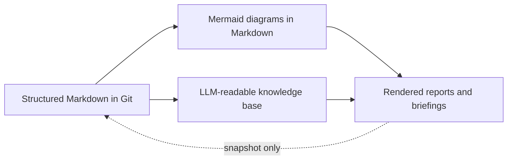

# Handoff Prompt: Create/Refresh UPE Architecture Artifacts

You are implementing a plan in the repository at `C:/Development/upe/UPE`. You are working on the UPE (Unified Project Execution) knowledge-base repository using the DDDM (Dialogue-Driven Design Method) framework.

## Critical Constraints

1. The user asked to create/refresh the following artifacts and update index/changelog:
   - `knowledge-base/architecture/arch_overview.md`
   - `knowledge-base/architecture/module_interfaces.md`
   - `knowledge-base/architecture/decisions/ADR-0001-docs-as-data.md`
   - `knowledge-base/reports/stakeholder_brief_2026-05-26.md`
   - `knowledge-base/prototypes/sprint-01_project_initialization/prototype_prompt.md`
   - Update `knowledge-base/00_index.md`
   - Update `knowledge-base/00_changelog.md`
2. Approved files that must not be modified unless explicitly part of the task:
   - `knowledge-base/master.md`
   - `knowledge-base/00_principles.md`
   - `knowledge-base/00_glossary.md`
   - all files under `knowledge-base/modules/m01_project_initialization/`
   - `knowledge-base/backlog/forks/project-intialization-module.md`
   - `knowledge-base/sessions/2026-05-26_m01_project_initialization_llm_session.md`
   - `knowledge-base/demo_script.md`
   - `00_index.md` and `00_changelog.md` are approved, but the user explicitly asked to update them, so only make the required updates there.
3. Every created/refreshed Markdown file must start with YAML front matter containing at least: `id`, `type`, `status`, `owner`, `version`, `last_updated`, `tags`. The approved repository standard in `knowledge-base/00_principles.md` also requires `parent`; include `parent` too.
4. All internal links must be relative paths.
5. Every file with process or architecture content must contain at least one Mermaid diagram. To be safe, include a Mermaid diagram in `arch_overview.md`, `module_interfaces.md`, and the ADR.
6. Do not invent new `REQ-*` or `ENT-*` identifiers. Existing M01 requirement/entity IDs are in:
   - `knowledge-base/modules/m01_project_initialization/requirements.md`
   - `knowledge-base/modules/m01_project_initialization/data_model.md`
7. Use consistent glossary terminology from `knowledge-base/00_glossary.md`: `Unified Project Execution`, `CDE`, `knowledge graph`, `master`, `fork`, `merge`, `ADR`.
8. The target files may already exist. Treat this as a content refresh/overwrite to match the requested content exactly.
9. As you complete each numbered plan step below, add a `[DONE:n]` marker in your working notes/final response, where `n` is the step number.

## Relevant Repository Context

### DDDM Framework

Source file: `prompts/LLM-Native Product Design Framework.md`

Key ideas:
- Docs-as-Data, Design-by-Dialogue.
- Knowledge base is structured Markdown, with Mermaid diagrams embedded in Markdown.
- `master` contains approved canonical knowledge; `fork` contains working hypotheses; `merge` moves reviewed content into master.
- Reports are rendered snapshots, never source of truth.

### Approved YAML Standard

From `knowledge-base/00_principles.md`, every `.md` file in `knowledge-base/` should begin with YAML front matter like:

```yaml
---
id: unique-artifact-id
type: requirement | entity | workflow | decision | module | report | session | fork | glossary | index | changelog | principles
status: idea | draft | in-review | approved | superseded | deprecated
owner: "@username"
version: 0.1
last_updated: YYYY-MM-DD
parent: relative/path/to/parent.md
tags: [tag1, tag2]
---
```

Note: existing files use `type: architecture` and `type: prototype`; keep repository consistency unless you decide otherwise. Do not edit `00_principles.md`.

### Master Context

`knowledge-base/master.md` defines Unified Project Execution as Ramboll's enterprise digital backbone.

What UPE is:
- Coordination & Intelligence Layer
- Process Orchestration
- Knowledge Platform
- Integration Hub
- Decision Support

What UPE is not:
- Does not replace CDE (`ACC`, `ProjectWise`)
- Does not replace DMS or authoring tools
- Does not replace ERP/CRM
- Is not a document store

M01 is Project Initialization & Provisioning and is the Phase 1 demo module.

### M01 Canonical Data Model

File: `knowledge-base/modules/m01_project_initialization/data_model.md`

Existing entities include:
- `ENT-Project`
- `ENT-ProjectTemplate`
- `ENT-ProvisioningJob`
- `ENT-ProvisioningTask`

Important fields:
- `Project`: `project_id`, `name`, `project_code`, `project_type_id`, `template_id`, `client_name`, `client_id`, `gbu`, `location`, `status`, `start_date`, `target_end_date`, `estimated_value`, `currency`, `opportunity_id`, `created_at`, `created_by`.
- `ProjectTemplate`: `template_id`, `name`, `description`, `project_class`, `supported_types`, `folder_structure`, `tool_configuration`, `standards_set`, `default_roles`, `default_channels`, `status`, `version`.
- `ProvisioningJob`: `job_id`, `project_id`, `status`, `started_at`, `completed_at`, `triggered_by`, `retry_count`.
- `ProvisioningTask`: `task_id`, `job_id`, `task_type`, `target_system`, `status`, `input_payload`, `output_payload`, `error_message`, `started_at`, `completed_at`, `retry_count`.

Do not add `estimated_setup_duration` to the canonical data model. If used, identify it as Template Library interface/prototype display metadata.

### M01 Existing Requirements

File: `knowledge-base/modules/m01_project_initialization/requirements.md`

Valid M01 requirement IDs include:
- Wizard: `REQ-M01-010` through `REQ-M01-017`
- Template/provisioning: `REQ-M01-020` through `REQ-M01-027`
- Provisioning status/recovery: `REQ-M01-050` through `REQ-M01-054`
- Non-functional/security: `REQ-M01-060` through `REQ-M01-067`

Avoid referencing requirement IDs unless they exist in that file.

### Copilot Sparing Session

File: `src/loop/loop.md`

The user specifically asks `arch_overview.md` to reference this file. The file contains `Copilot sparing session` and references layered architecture content such as Authoring Tools, CDE, integration/iPaaS, orchestration, enterprise data/AI, enterprise systems, collaboration UX, and build-vs-buy strategy. Use a relative link from `knowledge-base/architecture/arch_overview.md` to `../../src/loop/loop.md`.

### Demo Script

File: `knowledge-base/demo_script.md`

The stakeholder brief should reference this file using relative link `../demo_script.md` from `knowledge-base/reports/`.

## Full Plan to Execute

### 1. Refresh `knowledge-base/architecture/arch_overview.md`

Create/overwrite a complete Markdown document with YAML front matter:

```yaml
---
id: arch-overview
type: architecture
status: draft
owner: "@chief-architect"
version: 1.0
last_updated: 2026-05-26
parent: ../master.md
tags: [architecture, overview, cde, integration, azure]
---
```

Required content:
- Title: `# Architecture Overview — Unified Project Execution`
- State clearly that UPE is a coordination/intelligence layer, not a CDE or DMS.
- Hybrid build-vs-buy strategy:
  - Buy commodity layers: CDE, iPaaS, data lake infrastructure.
  - Build differentiating layers: engineering AI decomposition, knowledge graph, cross-platform decision intelligence, unified collaboration UX.
- Mermaid component diagram showing exactly the 7-layer stack:
  1. Authoring Tools
  2. CDE
  3. Integration/iPaaS
  4. Orchestration
  5. Enterprise Data/AI
  6. Enterprise Systems
  7. Collaboration UX
- Include key architectural principles:
  - Vendor independence
  - Open standards: `IFC`, `bSDD`, `W3C`
  - Microsoft Azure as cloud foundation
- References:
  - `../../src/loop/loop.md`
  - `../master.md`

Mark completion as `[DONE:1]`.

### 2. Refresh `knowledge-base/architecture/module_interfaces.md`

Create/overwrite a complete Markdown document with YAML front matter:

```yaml
---
id: module-interfaces
type: architecture
status: draft
owner: "@chief-architect"
version: 1.0
last_updated: 2026-05-26
parent: ../master.md
tags: [interfaces, m01, integration, contracts]
---
```

Required content:
- Title: `# Module Interface Contracts — M01 Project Initialization`
- Scope: M01 is the demo module; payloads are simplified and aligned to `../modules/m01_project_initialization/data_model.md`.
- Interface registry with exactly these stable IDs and labels:
  - `IF-M01-CRM-001`: CRM/Opportunity → Project seed data
  - `IF-M01-HR-001`: Azure AD/Workday → Users, org hierarchy, skills
  - `IF-M01-ERP-001`: ERP/Maconomy → Project codes, cost context
  - `IF-M01-M365-001`: Teams/SharePoint/Planner → Collaboration spaces
  - `IF-M01-CDE-001`: ACC/ProjectWise → CDE workspace provisioning
  - `IF-M01-TEMPLATE-001`: Template Library → Project template selection
  - `IF-M01-KG-001`: Knowledge Graph → Similar projects, reusable standards; status `deferred to Sprint 2`
- For each interface, include:
  - direction
  - trigger
  - simplified payload shape as JSON
  - error handling
  - owner
  - status
- Specific must-haves:
  - `IF-M01-ERP-001`: include retry + idempotency. Example fields: `project_id`, `opportunity_id`, `idempotency_key`, `project_code`, `cost_center`, `currency`. State retry max 3, idempotency key used on every retry, duplicates treated as success when code/context match.
  - `IF-M01-M365-001`: include `channel_templates` or `default_channels` from the selected template.
  - `IF-M01-TEMPLATE-001`: include `estimated_setup_duration`.
  - `IF-M01-KG-001`: mark deferred to Sprint 2 and non-blocking.
- Mermaid sequence diagram showing full provisioning flow across all interfaces. Suggested participants: PM, Wizard, CRM, Template Library, Knowledge Graph, ERP/Maconomy, Azure AD/Workday, Provisioning Orchestrator, M365, CDE.

Mark completion as `[DONE:2]`.

### 3. Refresh `knowledge-base/architecture/decisions/ADR-0001-docs-as-data.md`

Create/overwrite a complete ADR with YAML front matter:

```yaml
---
id: ADR-0001
type: decision
status: accepted
owner: "@chief-architect"
version: 1.0
last_updated: 2026-05-26
parent: ../arch_overview.md
tags: [ADR, docs-as-data, markdown, mermaid, git]
---
```

Required content:
- Title exactly: `# ADR-0001: Adopt Markdown + Mermaid + Git-style workflow as the single source of truth for UPE product design`
- `## Status`: `Accepted`
- `## Context`: traditional specs, Visio diagrams, and Word documents lose context, diverge from reality, and cannot be queried or versioned effectively.
- `## Decision`: all design knowledge lives as structured MD files in Git; diagrams are generated from Mermaid inside MD; reports are rendered snapshots, never source of truth.
- Add a small Mermaid diagram because this is a process/decision artifact, for example:



- `## Consequences`: positive and negative subsections.
- `## Alternatives Rejected`: Confluence wiki, SharePoint pages, traditional TOGAF artifacts, Enterprise Architect (Sparx).
- `## Review Date`: `2026-08-26`
- `## References`: relative link to `../../../prompts/LLM-Native Product Design Framework.md`.

Mark completion as `[DONE:3]`.

### 4. Refresh `knowledge-base/reports/stakeholder_brief_2026-05-26.md`

Create/overwrite the report with YAML front matter:

```yaml
---
id: stakeholder-brief-2026-05-26
type: report
status: draft
owner: "@chief-architect"
version: 0.1
last_updated: 2026-05-26
parent: ../master.md
tags: [report, stakeholder, brief, demo]
---
```

Required content:
- Include the derived snapshot warning from principles, e.g. `> ⚠️ This is a derived snapshot generated on 2026-05-26. For current authoritative knowledge, refer to ../master.md and ../modules/.`
- Audience: architects and module owners who will attend the demo session.
- 1-page narrative: why DDDM matters for UPE.
- Plain-language explanation:
  - `master`: the reviewed, shared truth.
  - `fork`: a safe working copy for a module owner to explore changes.
  - `prototype`: a clickable mock-up generated from the knowledge base to validate ideas, not the source of truth.
- What will be shown in demo, referencing `../demo_script.md`.
- Exactly three decisions requested from colleagues:
  1. Adopt this framework as the working method for UPE design?
  2. Assign module owners for M02–M05?
  3. Agree on branching convention and review cadence?
- Status should be `draft` / pending review.

Mark completion as `[DONE:4]`.

### 5. Refresh `knowledge-base/prototypes/sprint-01_project_initialization/prototype_prompt.md`

Create/overwrite the prototype prompt with YAML front matter:

```yaml
---
id: prototype-sprint01-m01
type: prototype
status: draft
owner: "@module-owner-m01"
version: 0.1
last_updated: 2026-05-26
parent: ../../modules/m01_project_initialization/index.md
tags: [prototype, m01, ui, prompt, sprint-01]
---
```

Required content:
- Make it a self-contained prompt ready to paste into v0.dev, Replit, or Claude.
- Reference canonical data model: `../../modules/m01_project_initialization/data_model.md`.
- Tech stack hint: React + TailwindCSS or shadcn/ui; mock data acceptable.
- State this is a design validation prototype, not production code.
- Describe exactly five demo screens:
  1. Project Creation Wizard (step 1: project type + template selection)
  2. Project Metadata Form (step 2: name, client, disciplines, GBA, location)
  3. Team & Access Setup (step 3: add members, assign roles)
  4. Provisioning Status Dashboard (real-time status per system: ERP, M365, CDE)
  5. Project Landing Page (post-initialization: summary, quick actions, notifications)
- Use canonical data-model terms where possible: Project, ProjectTemplate, User, Role, ProjectMembership, ProvisioningJob, ProvisioningTask, CollaborationSpace, CDEWorkspace.
- If you include `estimated_setup_duration`, label it as a Template Library/prototype display field, not a canonical M01 entity field.
- Avoid adding extra screens such as Template Library Admin or Access Management that were not requested.

Mark completion as `[DONE:5]`.

### 6. Update `knowledge-base/00_index.md`

Update the index entries for refreshed files to match their final statuses/types/owners:
- `architecture/arch_overview.md`
- `architecture/module_interfaces.md`
- `architecture/decisions/ADR-0001-docs-as-data.md`
- `reports/stakeholder_brief_2026-05-26.md`
- `prototypes/sprint-01_project_initialization/prototype_prompt.md`

Keep all approved root/module/fork/session/demo entries. Ensure no target file is orphaned. Update statistics if they are now inaccurate (especially status counts: report is draft; architecture may be draft/in-review; ADR accepted).

Mark completion as `[DONE:6]`.

### 7. Update `knowledge-base/00_changelog.md`

Add a new top entry above the existing `1.0.0` entry:

```markdown
## [1.0.1] — 2026-05-26

### Added / Updated — Architecture Artifact Completion Session

- Refreshed `architecture/arch_overview.md` with UPE positioning, hybrid build-vs-buy strategy, 7-layer Mermaid stack, and Azure/open-standards principles.
- Refreshed `architecture/module_interfaces.md` with seven M01 interface contracts and full provisioning sequence.
- Refreshed `architecture/decisions/ADR-0001-docs-as-data.md` to capture Markdown + Mermaid + Git-style workflow as accepted source-of-truth decision.
- Refreshed `reports/stakeholder_brief_2026-05-26.md` as a draft stakeholder brief for architects and module owners.
- Refreshed `prototypes/sprint-01_project_initialization/prototype_prompt.md` as a five-screen design validation prototype prompt.
- Updated `00_index.md` to keep the refreshed files registered.
```

Do not delete the existing `1.0.0` entry.

Mark completion as `[DONE:7]`.

### 8. Validate

Before final response:
- Check that every target file starts with YAML front matter.
- Check front matter contains required fields.
- Check `arch_overview.md`, `module_interfaces.md`, and ADR contain Mermaid diagrams.
- Check all internal links are relative.
- Check no new `REQ-*` or `ENT-*` IDs are invented.
- Check the seven interface IDs match exactly.
- Check terminology uses `Unified Project Execution`, `CDE`, `knowledge graph`, `master`, `fork`, `merge`, and `ADR` consistently.

Mark completion as `[DONE:8]`.

## Final Response Requirements

When done, provide a concise summary of files changed and include the `[DONE:n]` markers for all completed steps. Mention if any assumptions were made, especially around refreshing files that already existed and treating `estimated_setup_duration` as interface/prototype metadata rather than changing the canonical data model.
