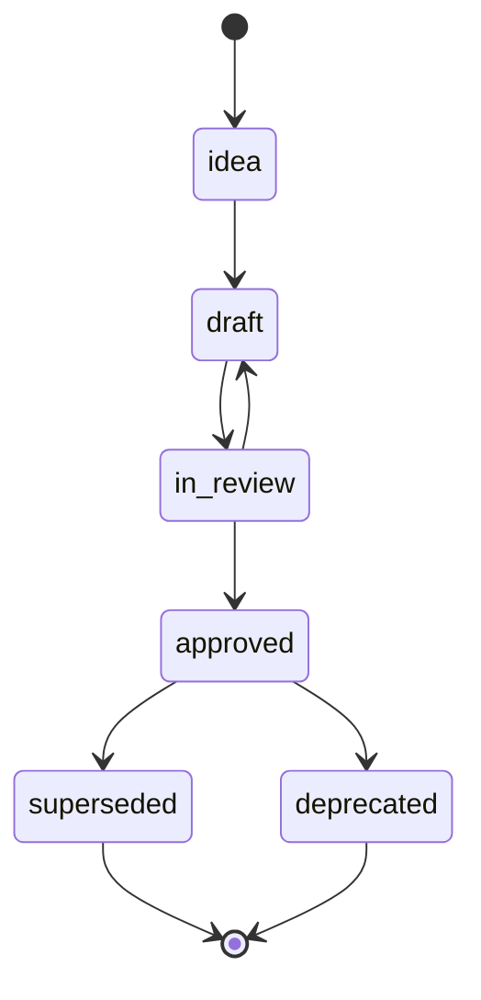
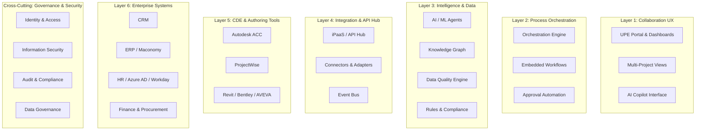

# UPE Knowledge Base Reference

**A complete guide to the DDDM-governed knowledge base at `knowledge-base/`.**

---

## Purpose and Scope

The `knowledge-base/` directory is the **canonical, DDDM-governed, Obsidian-compatible vault** for the UPE (Unified Project Execution) product design system. It is the single source of truth for all architecture decisions, requirements, entities, workflows, and module specifications.

It is **not** a code repository. It is **not** application source. It is the **design system manifest** — a living, queryable, LLM-compatible knowledge graph implemented as structured Markdown files under Git version control.

---

## DDDM: Dialogue-Driven Design Method

DDDM is an LLM-native product design methodology where:

1. **Data First** — Structured Markdown files with YAML front matter are the single source of truth. No Word documents, no Visio diagrams, no Confluence pages.
2. **Dialogue is Work** — LLM sessions are primary design instruments. Every session produces a commit.
3. **Single Source of Truth** — One canonical copy per artifact. Forks are temporary working branches.
4. **Modularity** — The system is decomposed into 14 independent modules (M01–M14), each with its own requirements, data model, workflows, and API specs.
5. **Traceability** — Every requirement, entity, and decision has a stable ID. Every artifact links to its parent and sources.
6. **Render on Demand** — Reports, presentations, and diagrams are generated from the master artifacts, never edited directly as source documents.

### Master/Fork Model

- **Master** (`main` branch) — contains only approved or actively reviewed canonical artifacts.
- **Fork** (`feature/*` branches) — working branches where module design happens via LLM sessions.
- **Merge** — after review passes all 6 Merge Gates, the fork is merged into `main` and the index/changelog are updated.
- **No direct edits to master** — all changes go through the fork→review→merge cycle.

---

## YAML Front Matter Requirements

Every file in `knowledge-base/` **must** have a YAML front matter block with these 8 fields:

```yaml
---
id: <stable-id>
type: <artifact-type>
status: <lifecycle-state>
owner: "<@role>"
version: <semver>
last_updated: <YYYY-MM-DD>
parent: <relative-path-to-parent>
tags: [<tag1>, <tag2>]
---
```

| Field | Description | Example |
|---|---|---|
| `id` | Stable, unique identifier following the ID scheme | `ADR-0001`, `REQ-M01-001` |
| `type` | Artifact type from the type taxonomy | `architecture`, `requirement`, `module` |
| `status` | Current lifecycle state | `approved`, `draft`, `in-review` |
| `owner` | Responsible role, prefixed with `@` | `@chief-architect`, `@scrum-master` |
| `version` | Semantic version of the artifact | `1.0`, `1.0.1` |
| `last_updated` | ISO date of last modification | `2026-05-26` |
| `parent` | Relative path to the parent artifact | `../master.md` |
| `tags` | Categorization tags | `[architecture, overview, cde]` |

---

## Stable ID Scheme

Every artifact receives a stable, unique identifier that never changes, even if the file is renamed or moved.

| Artifact Type | Pattern | Example |
|---|---|---|
| Requirement | `REQ-M{NN}-{SEQ}` | `REQ-M01-001` |
| Entity | `ENT-{Name}` | `ENT-Project` |
| Workflow Step | `WF-M{NN}-{SEQ}` | `WF-M01-010` |
| Interface Contract | `IF-M{NN}-{SYS}-{SEQ}` | `IF-M01-CRM-001` |
| Architecture Decision | `ADR-{SEQ}` | `ADR-0001` |
| Module | `M{NN}` | `M01` |
| Session Log | `SESSION-{date}-{topic}` | `SESSION-2026-05-26-m01` |

---

## Status Lifecycle

Every artifact moves through 6 lifecycle states:



| State | Meaning |
|---|---|
| `idea` | Proposed but not yet designed |
| `draft` | Under active design in a fork |
| `in-review` | Submitted for architecture review |
| `approved` | Reviewed and accepted as canonical |
| `superseded` | Replaced by a newer version |
| `deprecated` | No longer valid, retained for history |

**Transition rules:**
- `idea → draft`: design work begins
- `draft → in-review`: design complete, submitted for review
- `in-review → approved`: all merge gates pass
- `in-review → draft`: review failed, back to design
- `approved → superseded`: new version replaces this one
- `approved → deprecated`: artifact is retired

---

## Fork → Review → Merge Workflow

```
┌──────────┐    ┌──────────────┐    ┌──────────┐    ┌──────────┐
│ Create   │    │ Design in    │    │ Submit   │    │ Merge to │
│ fork     │───▶│ fork via     │───▶│ for      │───▶│ main &   │
│ branch   │    │ LLM sessions │    │ review   │    │ update   │
│          │    │              │    │          │    │ index    │
└──────────┘    └──────────────┘    └──────────┘    └──────────┘
```

1. **Create fork** — branch from `main` (e.g., `feature/m01-project-initialization`)
2. **Design in fork** — LLM sessions produce commits with new/modified KB artifacts
3. **Self-check** — validate front matter, stable IDs, no orphan files
4. **Submit for review** — open Pull Request, tag `@chief-architect`
5. **Pass/fail gates** — all 6 Merge Gates must pass
6. **Merge** — approved artifacts enter `main`; update `00_index.md` and `00_changelog.md`

---

## Six Merge Gates

Before any fork can merge into `main`, it must pass all six gates:

| # | Gate | Responsibility | Check |
|---|---|---|---|
| 1 | **Completeness** | Module Owner | All required artifact types present (requirements, data model, workflows, API spec, backlog) |
| 2 | **Traceability** | Module Owner | Every stable ID traced to a source document or prompt |
| 3 | **Interface Impact** | Chief Architect | All interface contracts (`IF-M{NN}-*`) reviewed for cross-module impact |
| 4 | **Data Model Impact** | Chief Architect | Entity changes reviewed against `ENT-*` across all modules |
| 5 | **Architecture Owner Approval** | Chief Architect | Explicit approval of all ADRs and architectural decisions |
| 6 | **Stakeholder Demo Readiness** | Scrum Master | Demo script updated, stakeholder brief current |

---

## Definition of Ready (DoR)

Before design begins on any module artifact, all 6 conditions must be met:

1. Stable ID assigned and registered in `00_index.md`
2. Parent artifact exists and is linked
3. Source documents referenced (prompts, meeting transcripts, vendor research)
4. Module owner assigned
5. Interface contracts drafted (if cross-module)
6. Dependencies on other modules documented

## Definition of Done (DoD)

Before any artifact can be marked `approved`, all 5 conditions must be met:

1. YAML front matter complete (all 8 fields)
2. Stable ID verified against the scheme
3. All Mermaid diagrams render correctly
4. `00_index.md` updated
5. `00_changelog.md` entry added

---

## Artifact Types and Folder Rules

| Artifact Type | Folder | Files |
|---|---|---|
| **Master** | `knowledge-base/` | `master.md` — main integration document |
| **Governance** | `knowledge-base/` | `00_index.md`, `00_glossary.md`, `00_principles.md`, `00_changelog.md` |
| **Architecture** | `knowledge-base/architecture/` | `arch_overview.md`, `module_interfaces.md` |
| **Decisions** | `knowledge-base/architecture/decisions/` | `ADR-{SEQ}-*.md` |
| **Module Artifacts** | `knowledge-base/modules/m{nn}_*/` | `index.md`, `requirements.md`, `data_model.md`, `workflows.md`, `api_spec.md`, `backlog.md` |
| **Forks (WIP)** | `knowledge-base/backlog/forks/` | Working copies before review |
| **Session Logs** | `knowledge-base/sessions/` | `SESSION-{date}-{topic}.md` |
| **Prototypes** | `knowledge-base/prototypes/` | Prototype prompts and specs |
| **Reports** | `knowledge-base/reports/` | **Derived only** — never edited directly |
| **Raw Input** | `knowledge-base/raw-input/` | Raw source materials awaiting synthesis |

**Key rules:**
- **Mermaid-only diagrams** — all visuals are Mermaid code blocks in Markdown. Never author diagrams manually.
- **Reports are derived** — `reports/` and `prototypes/` are rendered from master artifacts, never edited as source.
- **No orphan files** — every file must appear in `00_index.md`.

---

## Seven Governance Rules

1. **Never author diagrams manually** — all visuals are Mermaid in Markdown files.
2. **Every LLM session produces a commit** — no session without output to the repo.
3. **Data model is defined before workflow** — workflows reference entities, not the reverse.
4. **Interface contracts are written before module internals** — Chief Architect approves first.
5. **Reports and stakeholder docs are rendered from master** — never edited directly as source.
6. **No orphan files** — every file is linked in `00_index.md`.
7. **ADR for every significant decision** — Architecture Decision Records are mandatory.

---

## master.md Summary

`knowledge-base/master.md` is the **main integration document** for the entire UPE system.

### Vision
UPE is Ramboll's enterprise digital backbone — a cohesive platform ecosystem that orchestrates project delivery through integrated capabilities. It is a **coordination and intelligence layer**, not a replacement for existing tools.

### What UPE IS
- Coordination & Intelligence Layer — sits above CDEs and authoring tools
- Process Orchestration — automates project workflows across systems
- Knowledge Platform — captures, organizes, and leverages organizational intelligence
- Integration Hub — connects CRM, ERP, HR, CDE, and design tools
- Decision Support — AI-powered insights for project delivery

### What UPE is NOT
- ❌ Does NOT replace CDE (ACC, ProjectWise)
- ❌ Does NOT replace DMS/authoring tools (Revit, Bentley, AVEVA)
- ❌ Does NOT replace ERP/CRM
- ❌ Is NOT a document store
- ❌ Is NOT a generic project management tool

### Core Philosophy: The "Parameterized Constructor"
A stable core (chassis) with modular, configurable variations that produce thousands of unique, high-quality projects from standardized building blocks — like a car platform.

---

## 14 Functional Domains

| # | Domain | Code | Priority | Key Outcome |
|---|---|---|---|---|
| 1 | Project Lifecycle & Environment Management | M01 | 🔴 High | Consistent project startup, knowledge preservation |
| 2 | User & Access Management | M02 | 🔴 High | Faster team assembly, security, audit compliance |
| 3 | Project Planning & Delivery Management | M03 | 🔴 High | Clear accountability, early warning systems |
| 4 | Data Quality & Validation | M04 | 🟡 Medium | Reliable data, error prevention, design reuse |
| 5 | Information Governance & Knowledge Management | M05 | 🟡 Medium | Reduced knowledge loss, AI-ready data |
| 6 | AI Integration & Intelligence Capabilities | M06 | 🟢 Strategic | Automation at scale, smarter workflows |
| 7 | System Integration & Interoperability | M07 | 🟡 Medium | Flexible architecture, seamless data flow |
| 8 | Embedded Process Automation & Workflow | M08 | 🟡 Medium | Simpler workflows, higher compliance |
| 9 | User Experience & Interface Design | M09 | 🟡 Medium | Reduced friction, better situational awareness |
| 10 | Foundational Requirements & Technical Enablement | M10 | 🔴 High | Reliable foundation, extensibility |
| 11 | Platform Governance & Roadmap Management | M11 | 🟢 Strategic | Coherent evolution, stakeholder alignment |
| 12 | Monitoring, Diagnostics & Operational Support | M12 | 🟢 Strategic | Reliable operations, data-driven optimization |
| 13 | Technology Enablement & Build vs. Buy | M13 | 🟡 Medium | Cost efficiency, rapid capability delivery |
| 14 | Special Capability Domains (BIM/GIS, Time, Contracts) | M14 | 🟢 Strategic | End-to-end project coverage |

**Total: 175+ capabilities** across 14 domains.

---

## 7-Layer Architecture



---

## Phase 1 Scope (Months 1–6)

**Objective:** Establish core project context and basic automation.

| Capability | Module | Value |
|---|---|---|
| Project Initialization & Provisioning (MVP) | M01 | 40% faster project startup |
| Basic Data Model | M10 | Canonical project entities |
| User Onboarding/Offboarding | M02 | <1 day to onboard team member |
| Project Progress Tracking | M03 | Real-time project health |
| Role-Based Access Management | M02 | Secure, consistent access |
| Teams/SharePoint Integration | M07, M13 | Collaboration out of the box |

**Estimated Effort:** 4–6 FTE  
**Tech Stack:** Microsoft 365 E5 + Azure + Autodesk APIs  
**Primary Value:** 40% faster project startup, reduced errors

---

## ADR-0001: Docs-as-Data

| Field | Value |
|---|---|
| **ID** | ADR-0001 |
| **Status** | Accepted |
| **Date** | 2026-05-26 |
| **Review Date** | 2026-08-26 |

**Context:** The UPE project needed a single source of truth for architecture, requirements, and design artifacts that is LLM-compatible, version-controlled, and accessible to both humans and AI agents.

**Decision:** Adopt **Markdown + Mermaid + Git-style workflow** as the single source of truth for all UPE design artifacts. Use DDDM (Dialogue-Driven Design Method) as the governing methodology.

**Consequences (positive):**
- LLM agents can read, write, and validate design artifacts directly
- Version control provides full audit trail
- Markdown is universally readable
- Mermaid diagrams are code-reviewable and diff-friendly

**Consequences (negative):**
- Requires discipline: every artifact must follow front matter and ID conventions
- Merge gate process adds overhead to design iterations
- Not all stakeholders are comfortable with Git-based workflows

**Alternatives considered:**
- Confluence — rejected: not LLM-friendly, weak version control
- SharePoint — rejected: not LLM-friendly, poor structured data support
- TOGAF/Sparx — rejected: too heavyweight, not LLM-compatible
- Word + Visio — rejected: binary blobs, not diff-friendly, not LLM-queryable

---

## 00_index.md Tracking Model

`knowledge-base/00_index.md` is the **master inventory** of every file in the knowledge base. It implements the **no orphan files** rule:

- Every file is listed with its path, artifact type, status, owner, and purpose
- Statistics section tracks file counts by category
- Active feature branches are listed with module, status, and PR links
- When files are added or statuses change, `00_index.md` must be updated

---

## Current Feature Branch Status

| Branch | Module | Status | PR |
|---|---|---|---|
| `feature/m01-project-initialization` | M01 Project Initialization | `in-review-demo` | PR #1 |

The M01 module is under active design on `feature/m01-project-initialization`. Its artifacts (`modules/m01_project_initialization/` with 6 files, `backlog/forks/`, `sessions/`, `prototypes/`) will enter `main` after PR #1 passes all 6 Merge Gates.

All other modules (M02–M14) are in `idea` status — defined in `master.md` but not yet designed.

---

## File Inventory on main

| File | Type | Status |
|---|---|---|
| `master.md` | Master | `approved` |
| `00_index.md` | Index | `approved` |
| `00_glossary.md` | Glossary | `approved` |
| `00_principles.md` | Framework | `approved` |
| `00_changelog.md` | Changelog | `approved` |
| `architecture/arch_overview.md` | Architecture | `draft` |
| `architecture/module_interfaces.md` | Interface Contracts | `draft` |
| `architecture/decisions/ADR-0001-docs-as-data.md` | Decision (ADR) | `accepted` |
| `reports/stakeholder_brief_2026-05-26.md` | Report (Derived) | `draft` |
| `demo_script.md` | Demo Script (Derived) | `approved` |
| `raw-input/` (12 files) | Raw Input | `unprocessed` |

**Statistics (main):** 10 canonical files + 12 raw input files. M01 files (9 files) on feature branch.

---

## Source Traceability

All KB artifacts trace back to these source documents:

| Source | Path | Relevance |
|---|---|---|
| DDDM Methodology | `prompts/LLM-Native Product Design Framework.md` | Defines the DDDM approach |
| Executive Summary | `docs/UPE_Executive_Summary_v1.md` | 14 domains, phases, metrics |
| Functional Blocks | `docs/UPE_Functional_Blocks_v1.md` | 175+ capabilities |
| Brainstorming | `docs/brainstorming.md` | Module architecture, M365 stack |
| Loop Workstreams | `src/loop/loop.md` | WS 3.1–3.5, data model, integration |
| Architect Chat | `src/chat/UPE Platform Architects Chat.md` | Architectural concept evolution |
| Meeting Transcripts | `src/moms/` | Project Launch Series |
| Vendor Research | `src/vendors/` | AVEVA, Autodesk, Hexagon |
| Raw Input | `knowledge-base/raw-input/` | ISO 19650, capabilities, interviews, vision |
