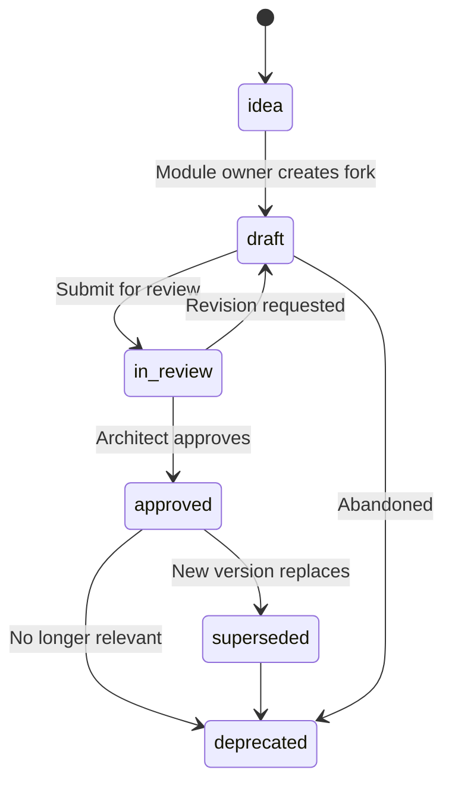
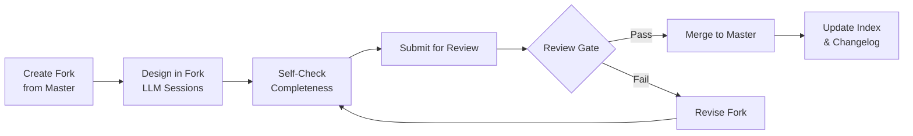

# UPE Knowledge Repository — Principles & Framework

## Philosophy: Docs-as-Data, Design-by-Dialogue

This repository follows the **DDDM (Dialogue-Driven Design Method)** adapted for enterprise product design:

1. **Data First** — every decision, requirement, flow, schema lives as structured MD; reports and diagrams are rendered on demand, never manually authored as separate artifacts.
2. **Dialogue is Work** — LLM sessions are the primary design instrument; outputs go directly to backlog/forks.
3. **Single Source of Truth** — `master.md` and approved module files under `modules/` are the canonical knowledge. Everything else is derivative or working hypothesis.
4. **Modularity** — each domain module is independently owned. The Chief Architect owns interfaces and integration contracts.
5. **Traceability** — every file has YAML front matter with owner, status, version, last-reviewed date, and parent.
6. **Render on Demand** — Mermaid generates all diagrams from MD; no manual diagram files.

---

## YAML Front Matter (Required for Every File)

Every `.md` file in `knowledge-base/` MUST begin with:

```yaml
---
id: unique-artifact-id          # e.g., REQ-M01-001, ADR-0001, ENT-Project
type: requirement | entity | workflow | decision | module | report | session | fork | glossary | index | changelog | principles
status: idea | draft | in-review | approved | superseded | deprecated
owner: "@username"
version: 0.1
last_updated: YYYY-MM-DD
parent: relative/path/to/parent.md
tags: [tag1, tag2]
---
```

---

## Stable ID Scheme

| Artifact Type | Pattern | Example |
|---|---|---|
| Requirement | `REQ-M{NN}-{SEQ}` | `REQ-M01-001` |
| Entity | `ENT-{Name}` | `ENT-Project`, `ENT-User` |
| Workflow Step | `WF-M{NN}-{SEQ}` | `WF-M01-010` |
| Interface Contract | `IF-M{NN}-{SYS}-{SEQ}` | `IF-M01-CRM-001` |
| Architecture Decision | `ADR-{SEQ}` | `ADR-0001` |
| Module | `M{NN}` | `M01` |
| Session Log | `SESSION-{date}-{topic}` | `SESSION-2026-05-26-m01` |

---

## Status Lifecycle



| Status | Meaning |
|---|---|
| `idea` | Mentioned but not yet elaborated |
| `draft` | Being worked on in a fork or module backlog |
| `in-review` | Submitted for review; under evaluation |
| `approved` | Merged into master; canonical knowledge |
| `superseded` | Replaced by a newer version |
| `deprecated` | No longer relevant; kept for audit trail |

---

## Fork → Review → Merge Lifecycle

### Rule: Master vs. Fork
- **Master** (`master.md` + `modules/*/`) contains **approved/current** knowledge.
- **Forks** (`backlog/forks/`) contain **working hypotheses and deltas**.
- No direct edits to master without passing review.

### Fork Workflow



---

## Merge Gates

Before a fork can be merged to master, ALL of the following must be satisfied:

| Gate | Description | Checked By |
|---|---|---|
| **Completeness** | All required sections present per artifact type | Module Owner |
| **Traceability** | Every requirement has stable ID; every decision linked to ADR | Scrum Master |
| **Interface Impact** | Changes to interfaces documented in `module_interfaces.md` | Chief Architect |
| **Data Model Impact** | Entity changes reflected in `data_model.md` with ERD updated | Chief Architect |
| **Architecture Owner Approval** | Chief Architect signs off on structural changes | Chief Architect |
| **Stakeholder Demo Readiness** | For demo milestones: prototype or walk-through available | Product Owner |

---

## Definition of Ready (DoR)

A fork is ready for review when:
1. YAML front matter is complete and correct
2. All proposed changes are explicitly listed (deltas)
3. Stable IDs assigned to new requirements/entities/workflows
4. Mermaid diagrams render correctly
5. Interface impact table is filled (even if "no impact")
6. Open questions are listed explicitly

## Definition of Done (DoD)

A fork merge is done when:
1. All merge gates passed
2. `00_index.md` updated with new/changed artifacts
3. `00_changelog.md` updated with merge entry
4. Affected `master.md` sections updated
5. No orphan files introduced

---

## Artifact Types & Folder Rules

| Folder | Artifact Types | Rules |
|---|---|---|
| `knowledge-base/master.md` | Master integration document | Only updated after approved merge |
| `knowledge-base/00_*.md` | Index, principles, glossary, changelog | Maintained by Scrum Master / Architect |
| `knowledge-base/architecture/` | Overview, interfaces, ADR decisions | Owned by Chief Architect |
| `knowledge-base/modules/m{nn}_*/` | Module slices (index, requirements, data_model, workflows, api_spec, backlog) | Owned by Module Owner |
| `knowledge-base/backlog/forks/` | Working forks before review | Module Owner creates; Architect reviews |
| `knowledge-base/sessions/` | LLM session logs | Logged after every LLM design session |
| `knowledge-base/prototypes/` | Prototype prompts and specs | Generated from master knowledge; NOT source of truth |
| `knowledge-base/reports/` | Stakeholder briefs, snapshots | **Derived output only. Must NOT become source of truth.** |

---

## Diagram Rule

- All diagrams use **Mermaid** syntax embedded in Markdown.
- No external diagram files (`.drawio`, `.vsdx`, `.png`).
- Diagrams must be renderable by any standard Mermaid engine.

---

## Reports-as-Derived-Output Rule

> **Reports, stakeholder briefs, and generated documents are snapshots derived from the knowledge base. They are NOT source of truth. If a report contradicts master, master wins.**

Reports must include this header:
```
> ⚠️ This is a derived snapshot generated on {date}. For current authoritative knowledge, refer to `master.md` and `modules/`.
```

---

## Key Governance Rules

1. **Never author diagrams manually** — all visuals are Mermaid in MD files.
2. **Every LLM session produces a commit** — no session without output to repo.
3. **Data model is defined before workflow** — workflows reference entities, not the reverse.
4. **Interface contracts are written before module internals** — Chief Architect approves first.
5. **Reports and stakeholder docs are rendered from master** — never edited directly as source.
6. **No orphan files** — every file is linked in `00_index.md`.
7. **ADR for every significant decision** — Architecture Decision Records are mandatory.
