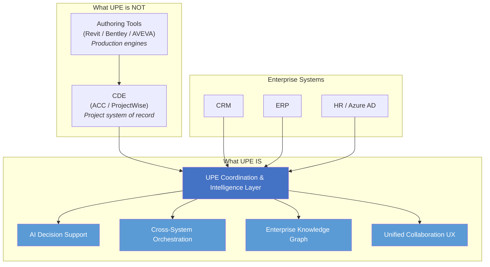
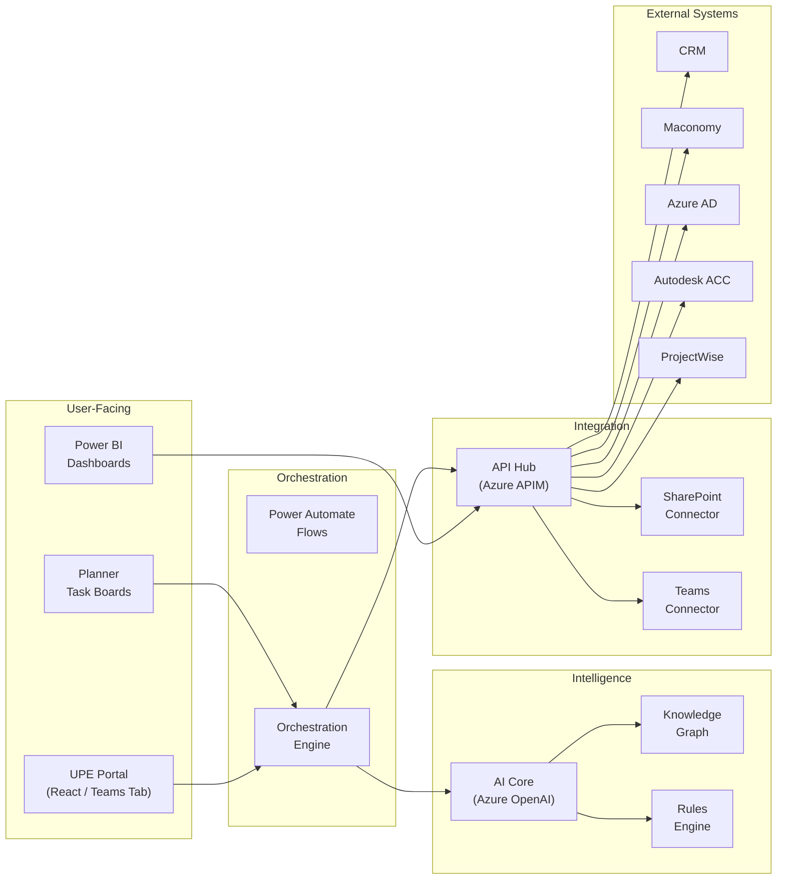

# Architecture Overview

## UPE Position in the Technology Landscape

UPE is NOT a CDE. UPE is NOT a DMS. UPE is NOT a replacement for engineering authoring tools.

**CDE is necessary but not the enterprise brain.** CDEs like Autodesk ACC and ProjectWise serve as the project-level system of record for document management, version control, approvals, and design coordination. They are project-centric, not enterprise-centric.

**UPE sits ABOVE CDEs and authoring tools** as a coordination and intelligence layer:

---

## Build vs. Buy Principle

**Buy commodity layers. Build differentiating layers.**

### Buy (Don't reinvent)
| Layer | Recommended | Rationale |
|---|---|---|
| CDE | Autodesk ACC / Bentley ProjectWise | Market-leading, vendor-supported |
| iPaaS | MuleSoft / Workato / Dell Boomi | Proven integration platforms |
| Data Lake | Microsoft Fabric / OneLake | Enterprise scale, Azure-native |
| Identity & Security | Azure AD, Microsoft Entra | Already in E5 license |
| Workflow Engine | Power Automate / Camunda | Commodity orchestration |

### Build (Strategic differentiators)
| Layer | What to Build | Why |
|---|---|---|
| AI-Ready Engineering Decomposition | Document decomposition, metadata enrichment, chunking for LLM | Domain-specific, no vendor provides this |
| Cross-Platform Knowledge Graph | Project memory, semantic relationships, cross-project learning | Enterprise moat |
| Decision Intelligence Layer | Margin-aware design intelligence, risk detection | Ramboll-specific business logic |
| Unified Collaboration UX | Cross-tool project dashboards, multi-system issue resolution | Missing in current market |
| Engineering-Specific AI Agents | Domain agents for each discipline workflow | Competitive advantage |

---

## Component Architecture

---

## Key Integration Points

| Integration | Direction | Protocol | Priority |
|---|---|---|---|
| CRM → UPE | Project seed data on won opportunity | REST API / Webhook | Phase 1 |
| Azure AD → UPE | User identity, org structure, roles | Graph API | Phase 1 |
| Maconomy → UPE | Project codes, cost centers | REST API | Phase 1 |
| Teams/SharePoint ↔ UPE | Collaboration spaces, document stores | Graph API, Power Automate | Phase 1 |
| Autodesk ACC ↔ UPE | CDE workspace provisioning, file metadata | ACC API / Webhooks | Phase 1 |
| ProjectWise ↔ UPE | CDE workspace (alternative stack) | PW API | Phase 2 |
| Workday → UPE | HR data, skills, org hierarchy | REST API | Phase 2 |
| Power BI ← UPE | Analytics and dashboards | DirectQuery / Semantic models | Phase 1 |

---

## References
- **Source:** `src/loop/loop.md` (Copilot Sparing Session — 9-layer architecture)
- **Source:** `docs/brainstorming.md` (Tech stack, module architecture)
- **Related:** [module_interfaces.md](module_interfaces.md) — detailed interface contracts for M01
