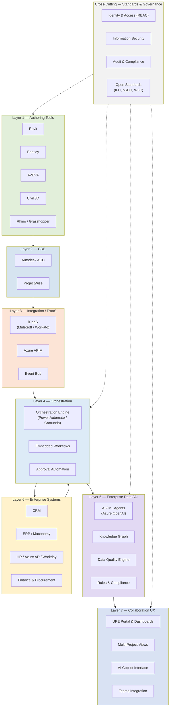

# Architecture Overview — Unified Project Execution

## UPE Position in the Technology Landscape

**UPE (Unified Project Execution)** is a **coordination and intelligence layer** — it sits above existing tools and systems, orchestrating workflows, providing AI-powered insights, and unifying the project delivery experience.

> **What UPE is NOT:**
> - ❌ NOT a **CDE** (Common Data Environment) — ACC and ProjectWise remain the project systems of record
> - ❌ NOT a **DMS** (Document Management System) — engineers continue using Revit, Bentley, AVEVA
> - ❌ NOT a replacement for **ERP/CRM** — UPE integrates with them, never substitutes
> - ❌ NOT a document store — it is a coordination and intelligence surface

UPE adds value by connecting, automating, and intelligentising the ecosystem that already exists — not by replacing it.

---

## Hybrid Build-vs-Buy Strategy

**Buy commodity layers. Build differentiating layers.**

### Buy (Don't reinvent)

| Layer | Recommended | Rationale |
|---|---|---|
| CDE | Autodesk ACC / Bentley ProjectWise | Market-leading, vendor-supported |
| iPaaS | MuleSoft / Workato / Dell Boomi | Proven integration platforms |
| Data Lake Infrastructure | Microsoft Fabric / OneLake | Enterprise scale, Azure-native |
| Identity & Security | Azure AD (Microsoft Entra) | Already in E5 license |
| Workflow Engine | Power Automate / Camunda | Commodity orchestration |

### Build (Strategic differentiators)

| Layer | What to Build | Why |
|---|---|---|
| AI-Ready Engineering Decomposition | Document decomposition, metadata enrichment, chunking for LLM | Domain-specific — no vendor provides this |
| Cross-Platform Knowledge Graph | Project memory, semantic relationships, cross-project learning | Enterprise moat |
| Decision Intelligence Layer | Margin-aware design intelligence, risk detection | Ramboll-specific business logic |
| Unified Collaboration UX | Cross-tool project dashboards, multi-system issue resolution | Missing in current market |
| Engineering-Specific AI Agents | Domain agents for each discipline workflow | Competitive advantage |

---

## 7-Layer Component Architecture

The following diagram shows the complete UPE technology stack as seven distinct layers, with cross-cutting governance and an Azure foundation.

**Layer responsibilities:**

| Layer | Role | Key Technologies |
|---|---|---|
| **1. Authoring Tools** | Production engines where design work happens | Revit, Bentley, AVEVA, Civil 3D, Rhino |
| **2. CDE** | Project-level system of record for documents and design coordination | Autodesk ACC, ProjectWise |
| **3. Integration / iPaaS** | Middleware for connecting all systems via APIs and events | MuleSoft/Workato, Azure APIM, Event Bus |
| **4. Orchestration** | Process automation engine driving cross-system workflows | Power Automate, Camunda, approval flows |
| **5. Enterprise Data / AI** | Intelligence layer: knowledge graph, AI agents, data quality | Azure OpenAI, Knowledge Graph, rules engine |
| **6. Enterprise Systems** | Corporate systems of record (CRM, ERP, HR, Finance) | Dynamics 365, Maconomy, Azure AD, Workday |
| **7. Collaboration UX** | Unified user experience across tools and projects | UPE Portal, Teams integration, AI Copilot |

---

## Architectural Principles

| Principle | Description |
|---|---|
| **Vendor Independence** | Avoid deep lock-in to any single vendor; use open APIs and standard protocols. Prefer COTS over custom where the capability is commodity. |
| **Open Standards** | Adopt `IFC` (Industry Foundation Classes) for building data, `bSDD` (buildingSMART Data Dictionary) for classification, `W3C` standards for semantic web and knowledge graph. |
| **Microsoft Azure as Cloud Foundation** | Azure is the primary cloud platform (consistent with Ramboll's E5 licensing). All cloud-native services (APIM, OpenAI, Entra, Fabric) run on Azure. |
| **CDE as System of Record** | The CDE remains the authoritative project-level store. UPE reads from and provisions into CDE — never replaces it. |
| **API-First Integration** | Every system communicates through well-defined APIs and interface contracts. No shared databases, no file-based batch imports. |
| **Idempotent Operations** | All provisioning and write operations must be idempotent — safe to retry without side effects. |

---

## References

- **Copilot Sparing Session:** [../../src/loop/loop.md](../../src/loop/loop.md) — detailed layer analysis and build-vs-buy discussion
- **UPE Master:** [../master.md](../master.md) — vision, 14 domains, module registry
- **Interface Contracts:** [module_interfaces.md](module_interfaces.md) — detailed M01 interface contracts
- **ADR-0001:** [decisions/ADR-0001-docs-as-data.md](decisions/ADR-0001-docs-as-data.md) — Markdown + Mermaid + Git as source of truth
