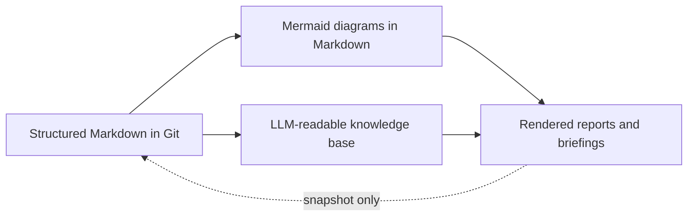

# ADR-0001: Adopt Markdown + Mermaid + Git-style workflow as the single source of truth for UPE product design

## Status

**Accepted**

---

## Context

Traditional product specifications — Word documents, Visio diagrams, SharePoint pages — suffer from fundamental problems that make them unsuitable for an LLM-native design process:

- **Stale on arrival:** Traditional specs lose context the moment they are written. Design evolves, documents don't keep up.
- **Diverge from reality:** Visio diagrams and Word files drift from the actual system behavior over time.
- **Cannot be queried or versioned effectively:** Binary formats resist diffing, searching, and programmatic analysis.
- **LLM-hostile:** Proprietary and binary formats cannot be used as context in AI-assisted design sessions.
- **Siloed ownership:** No clear fork/review/merge workflow — one person writes, others comment asynchronously.

For the UPE (Unified Project Execution) product design process, we need a source-of-truth system that supports iterative LLM-assisted design, modular ownership, full traceability, and machine-readable metadata.

---

## Decision

We adopt **Markdown + Mermaid + Git-style workflow** as the single source of truth for all UPE product design knowledge:

1. **All design knowledge lives as structured `.md` files** in a versioned repository (`knowledge-base/`).
2. **Diagrams are generated from Mermaid** embedded directly in Markdown — no external diagram files.
3. **Git-style discipline** governs knowledge evolution:
   - `master.md` + approved `modules/` = canonical knowledge (like `main` branch)
   - `backlog/forks/` = working hypotheses before review (like feature branches)
   - Merge gates enforce completeness, traceability, and architect review
4. **YAML front matter** on every file provides machine-readable metadata (`id`, `type`, `status`, `owner`, `version`, `last_updated`, `parent`, `tags`).
5. **Stable IDs** for requirements, entities, workflows, interfaces, and decisions — never change once assigned.
6. **Reports are rendered snapshots, never source of truth** — always derived from the knowledge base.

---

## Consequences

### Positive

- **LLM-native:** Markdown is the natural language of LLMs — design happens through structured dialogue, and outputs are immediately usable in AI sessions.
- **Always in sync:** Mermaid diagrams live inside the data they describe; they update when the Markdown updates.
- **Version-controlled:** Every change is tracked with full history; rollback is trivial.
- **Review-friendly:** Diff-based review (PR style) makes design changes transparent and auditable.
- **Tool-agnostic:** Any Markdown editor works — Obsidian, VS Code, GitHub, Azure DevOps.
- **Searchable & queryable:** Text-based knowledge can be indexed, searched, and analysed programmatically.
- **Fast iteration:** No formatting overhead, no diagram export steps, no manual sync.

### Negative

- **Mermaid limitations:** Complex diagrams (BPMN-level detail, large-scale architecture views) are harder in Mermaid than in dedicated tools like Sparx Enterprise Architect.
- **Learning curve:** Team members must learn Mermaid syntax and the Git-style master/fork/merge workflow.
- **Rendering dependency:** Requires a Mermaid-capable viewer (GitHub, Obsidian, VS Code, Azure DevOps Wiki).
- **Not a replacement for all documentation:** Legal contracts, compliance filings, and regulatory submissions still require traditional formats.

---

## Alternatives Rejected

| Alternative | Why Rejected |
|---|---|
| **Confluence wiki** | Proprietary format, opaque versioning, no native Mermaid support, poor Git integration, reports become stale wiki pages |
| **SharePoint pages** | Binary/proprietary storage, no structured metadata, versioning is opaque, not LLM-friendly |
| **Traditional TOGAF artifacts** (Word + Visio + Excel) | Manual diagram drift, no automation, binary formats cannot be queried or versioned, heavy governance overhead |
| **Enterprise Architect (Sparx)** | Desktop-bound, binary repository, no LLM integration, steep licensing cost, diagrams separate from textual knowledge |

---

## Review Date

**2026-08-26** — Re-evaluate after stakeholder adoption and Sprint 1 delivery. Consider:
- Whether Mermaid covers all diagram needs or if a PlantUML supplement is required
- Whether Azure DevOps Wiki or Obsidian becomes the primary rendering tool
- Adoption feedback from module owners
- Whether additional diagram types (BPMN,SysML) are needed

---

## References

- **DDDM Framework source:** [../../../prompts/LLM-Native Product Design Framework.md](../../../prompts/LLM-Native Product Design Framework.md)
- **Architecture Overview:** [../arch_overview.md](../arch_overview.md)
- **UPE Master:** [../../master.md](../../master.md)
- **Glossary:** [../../00_glossary.md](../../00_glossary.md)
