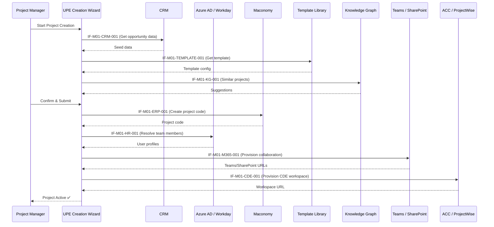

# Module Interface Contracts — M01 Project Initialization

This document defines first-level interface contracts for Module M01 (Project Initialization & Provisioning). Each contract specifies the data exchange boundary between UPE and an external system during project initialization.

---

## Interface Registry

| Interface ID | Name | Producer | Consumer | Trigger |
|---|---|---|---|---|
| IF-M01-CRM-001 | Opportunity → Project Seed | CRM | UPE M01 | Opportunity won |
| IF-M01-HR-001 | Users & Org Units | Azure AD / Workday | UPE M01 | On-demand / Project creation |
| IF-M01-ERP-001 | Project Codes & Cost Context | Maconomy | UPE M01 | Project creation |
| IF-M01-M365-001 | Collaboration Spaces | UPE M01 | Teams / SharePoint / Planner | Template provisioning step |
| IF-M01-CDE-001 | CDE Workspace Provisioning | UPE M01 | ACC / ProjectWise | Template provisioning step |
| IF-M01-TEMPLATE-001 | Project Template Selection | Standards Library | UPE M01 | Template selection in wizard |
| IF-M01-KG-001 | Knowledge Graph Context | UPE Knowledge Graph | UPE M01 | Similarity query on creation |

---

## IF-M01-CRM-001: Opportunity → Project Seed Data

| Field | Value |
|---|---|
| **Purpose** | Create a project seed from a won CRM opportunity |
| **Producer** | CRM (e.g., Salesforce, Dynamics 365) |
| **Consumer** | UPE M01 — Project Creation Service |
| **Trigger** | Opportunity status changes to "Won" or PM triggers manually |
| **Protocol** | REST API (webhook or poll) |

### Key Payload Fields
```json
{
  "opportunity_id": "string",
  "client_name": "string",
  "client_id": "string",
  "project_name": "string",
  "project_type": "string",
  "gbu": "string",
  "disciplines": ["string"],
  "estimated_value": "decimal",
  "location": "string",
  "expected_start_date": "date",
  "pm_contact_email": "string",
  "sales_lead_email": "string"
}
```

### Output
- `project_seed_id` created in UPE
- Status: `seed_created`

### Failure Modes
| Failure | Handling |
|---|---|
| Opportunity data incomplete | Return validation error with missing fields list |
| Duplicate opportunity detected | Warn and request confirmation |
| CRM API unavailable | Queue for retry (max 3 attempts, 5-min intervals) |

---

## IF-M01-HR-001: Users & Org Units

| Field | Value |
|---|---|
| **Purpose** | Retrieve user profiles, org units, skills for project team setup |
| **Producer** | Azure AD / Workday |
| **Consumer** | UPE M01 — Team Assembly Service |
| **Trigger** | On-demand during project creation wizard |
| **Protocol** | Microsoft Graph API / Workday REST API |

### Key Payload Fields
```json
{
  "user_id": "string (Azure AD ObjectId)",
  "display_name": "string",
  "email": "string",
  "department": "string",
  "job_title": "string",
  "office_location": "string",
  "manager_id": "string",
  "skills": ["string"],
  "discipline": "string",
  "org_unit": "string"
}
```

### Output
- User available for assignment to project roles
- Org hierarchy resolved for approval routing

### Failure Modes
| Failure | Handling |
|---|---|
| User not found in Azure AD | Return "user not found", suggest manual entry |
| Stale data from Workday | Cache with 24h TTL, flag for refresh |
| API rate limiting | Exponential backoff |

---

## IF-M01-ERP-001: Project Codes & Cost Context

| Field | Value |
|---|---|
| **Purpose** | Obtain project code, cost center, billing context from ERP |
| **Producer** | Maconomy |
| **Consumer** | UPE M01 — Project Code Assignment |
| **Trigger** | Project creation (after seed data accepted) |
| **Protocol** | REST API |

### Key Payload Fields
```json
{
  "project_code": "string",
  "cost_center": "string",
  "billing_type": "string (T&M | Fixed | Hybrid)",
  "budget_amount": "decimal",
  "currency": "string",
  "client_reference": "string",
  "wbs_code": "string"
}
```

### Output
- Project linked to ERP financial context
- Cost tracking enabled

### Failure Modes
| Failure | Handling |
|---|---|
| Maconomy unavailable | Queue project as `pending_financial`, retry on schedule |
| Code already exists | Error, request alternative code |
| Invalid cost center | Return validation error |

---

## IF-M01-M365-001: Collaboration Space Provisioning

| Field | Value |
|---|---|
| **Purpose** | Create Teams team, SharePoint site, Planner board for new project |
| **Producer** | UPE M01 — Provisioning Orchestrator |
| **Consumer** | Microsoft Teams / SharePoint / Planner |
| **Trigger** | Provisioning workflow step in project creation |
| **Protocol** | Microsoft Graph API |

### Key Payload Fields
```json
{
  "project_id": "string",
  "project_name": "string",
  "team_name": "string",
  "sharepoint_site_url": "string",
  "planner_plan_name": "string",
  "template_id": "string",
  "members": [
    {
      "user_id": "string",
      "role": "string (owner | member)"
    }
  ],
  "channels": [
    {
      "name": "string",
      "description": "string"
    }
  ]
}
```

### Output
- Teams team created with channels per template
- SharePoint site provisioned with folder structure
- Planner board created with initial tasks
- All URLs stored in project record

### Failure Modes
| Failure | Handling |
|---|---|
| Teams provisioning timeout | Retry up to 3 times; log partial state |
| Naming collision | Append suffix, notify PM |
| Permission denied | Escalate to IT admin; queue for manual creation |

---

## IF-M01-CDE-001: CDE Workspace Provisioning

| Field | Value |
|---|---|
| **Purpose** | Create CDE workspace (ACC or ProjectWise) for new project |
| **Producer** | UPE M01 — Provisioning Orchestrator |
| **Consumer** | Autodesk ACC / Bentley ProjectWise |
| **Trigger** | Provisioning workflow step after M365 provisioning |
| **Protocol** | ACC API / ProjectWise API |

### Key Payload Fields
```json
{
  "project_id": "string",
  "project_name": "string",
  "cde_platform": "string (ACC | ProjectWise)",
  "template_workspace_id": "string",
  "folder_structure": [
    {
      "path": "string",
      "permissions": "string"
    }
  ],
  "disciplines": ["string"],
  "standards_set_id": "string"
}
```

### Output
- CDE workspace URL
- Folder structure created
- Access policies applied per template
- CDE workspace linked to project record

### Failure Modes
| Failure | Handling |
|---|---|
| ACC API unavailable | Queue for retry; allow project to proceed in `partial` state |
| Template not found | List available templates; request manual selection |
| License limit exceeded | Alert admin; queue for manual provisioning |

---

## IF-M01-TEMPLATE-001: Project Template Selection

| Field | Value |
|---|---|
| **Purpose** | Select appropriate project template based on type, class, GBA |
| **Producer** | UPE Standards / Template Library |
| **Consumer** | UPE M01 — Project Creation Wizard |
| **Trigger** | User selects project type/class in creation wizard |
| **Protocol** | Internal API |

### Key Payload Fields
```json
{
  "template_id": "string",
  "template_name": "string",
  "project_type": "string",
  "project_class": "string",
  "gbu": "string",
  "disciplines": ["string"],
  "folder_structure_ref": "string",
  "tool_configuration": "object",
  "standards_set_ref": "string",
  "default_roles": ["string"],
  "default_workflows": ["string"]
}
```

### Output
- Template loaded into creation wizard
- Pre-populated configuration for all provisioning steps

### Failure Modes
| Failure | Handling |
|---|---|
| No template for project type | Offer "blank" template with minimal defaults |
| Template version conflict | Use latest approved version |

---

## IF-M01-KG-001: Knowledge Graph Context

| Field | Value |
|---|---|
| **Purpose** | Query knowledge graph for similar projects, reusable standards, context |
| **Producer** | UPE Knowledge Graph |
| **Consumer** | UPE M01 — Project Creation Wizard |
| **Trigger** | PM requests similar project suggestions during creation |
| **Protocol** | Internal API (GraphRAG) |

### Key Payload Fields
```json
{
  "query": {
    "project_type": "string",
    "client": "string",
    "location": "string",
    "disciplines": ["string"],
    "scope_keywords": ["string"]
  },
  "top_k": 5,
  "include_standards": true
}
```

### Output
```json
{
  "similar_projects": [
    {
      "project_id": "string",
      "name": "string",
      "similarity_score": "float",
      "template_used": "string",
      "lessons_learned_ref": "string"
    }
  ],
  "suggested_standards": [
    {
      "standard_id": "string",
      "name": "string",
      "relevance_score": "float"
    }
  ]
}
```

### Failure Modes
| Failure | Handling |
|---|---|
| Knowledge graph unavailable | Skip suggestions; proceed without (non-blocking) |
| No similar projects found | Return empty list; suggest browsing template library |

---

## Cross-Interface Sequence


