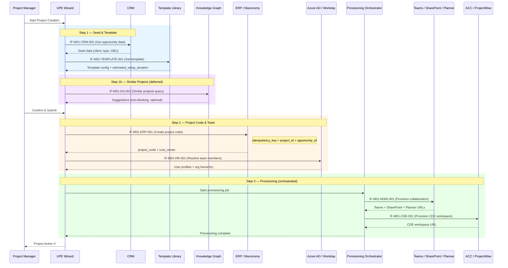

# Module Interface Contracts — M01 Project Initialization

This document defines interface contracts for **Module M01 (Project Initialization & Provisioning)** — the Phase 1 demo module. All payload shapes are simplified and aligned to the canonical data model defined in [../modules/m01_project_initialization/data_model.md](../modules/m01_project_initialization/data_model.md).

> **Scope note:** M01 is the demo module. These contracts represent the integration boundary between UPE and external systems during project creation and provisioning. Payloads are simplified for the MVP phase.

---

## Interface Registry

| Interface ID | Name | Direction | Owner | Status |
|---|---|---|---|---|
| `IF-M01-CRM-001` | Opportunity → Project Seed Data | CRM → UPE | @module-owner-m01 | `active` |
| `IF-M01-HR-001` | Users & Org Hierarchy | Azure AD / Workday → UPE | @module-owner-m01 | `active` |
| `IF-M01-ERP-001` | Project Codes & Cost Context | ERP / Maconomy → UPE | @module-owner-m01 | `active` |
| `IF-M01-M365-001` | Collaboration Spaces | UPE → Teams / SharePoint / Planner | @module-owner-m01 | `active` |
| `IF-M01-CDE-001` | CDE Workspace Provisioning | UPE → ACC / ProjectWise | @module-owner-m01 | `active` |
| `IF-M01-TEMPLATE-001` | Project Template Selection | Template Library → UPE | @module-owner-m01 | `active` |
| `IF-M01-KG-001` | Knowledge Graph Context | Knowledge Graph → UPE | @module-owner-m01 | `deferred to Sprint 2` |

---

## IF-M01-CRM-001: Opportunity → Project Seed Data

| Field | Value |
|---|---|
| **Direction** | CRM → UPE M01 |
| **Trigger** | Opportunity status changes to "Won" or PM triggers manually |
| **Owner** | @module-owner-m01 |
| **Status** | `active` |

### Payload

```json
{
  "opportunity_id": "string",
  "client_name": "string",
  "client_id": "string",
  "project_name": "string",
  "project_type": "string",
  "gbu": "string",
  "disciplines": ["string"],
  "estimated_value": "decimal",
  "currency": "string",
  "location": "string",
  "expected_start_date": "date",
  "pm_contact_email": "string",
  "sales_lead_email": "string"
}
```

### Output

- `project_seed_id` created in UPE
- Status transitions to `seed_created`

### Error Handling

| Condition | Response |
|---|---|
| Opportunity data incomplete | `400 Validation Error` — list missing fields |
| Duplicate opportunity detected | `409 Conflict` — warn and request confirmation |
| CRM API unavailable | Queue for retry (max 3 attempts, 5-min intervals) |

---

## IF-M01-HR-001: Users, Org Hierarchy & Skills

| Field | Value |
|---|---|
| **Direction** | Azure AD / Workday → UPE M01 |
| **Trigger** | On-demand during project creation wizard (team assembly step) |
| **Owner** | @module-owner-m01 |
| **Status** | `active` |

### Payload

```json
{
  "user_id": "string (Azure AD ObjectId)",
  "display_name": "string",
  "email": "string",
  "department": "string",
  "job_title": "string",
  "office_location": "string",
  "manager_id": "string",
  "skills": ["string"],
  "discipline": "string",
  "org_unit": "string"
}
```

### Output

- User available for assignment to project roles
- Org hierarchy resolved for approval routing

### Error Handling

| Condition | Response |
|---|---|
| User not found in Azure AD | `404 Not Found` — suggest manual entry |
| Stale data from Workday | Cache with 24h TTL, flag for refresh |
| API rate limiting | Exponential backoff |

---

## IF-M01-ERP-001: Project Codes & Cost Context

| Field | Value |
|---|---|
| **Direction** | ERP / Maconomy → UPE M01 |
| **Trigger** | Project creation — after seed data accepted |
| **Owner** | @module-owner-m01 |
| **Status** | `active` |

### Payload

```json
{
  "project_id": "string",
  "opportunity_id": "string",
  "idempotency_key": "string (derived from project_id + opportunity_id)",
  "project_code": "string",
  "cost_center": "string",
  "billing_type": "string (T&M | Fixed | Hybrid)",
  "budget_amount": "decimal",
  "currency": "string",
  "client_reference": "string",
  "wbs_code": "string"
}
```

### Retry & Idempotency

- **Idempotency key** is derived from `project_id` + `opportunity_id` — every retry sends the same key.
- **Max retries:** 3 attempts with exponential backoff (5s, 30s, 120s).
- **Duplicate handling:** If the ERP returns an existing project code matching the `idempotency_key`, treat it as **success** — compare returned `project_code` and `cost_center`; if they match the original request, return `200 OK` (no side effects).
- **Partial failure:** If project code is created but cost center assignment fails, mark provisioning task as `retrying` and retry only the failed step.

### Output

- Project linked to ERP financial context
- Cost tracking enabled via `project_code` + `cost_center`

### Error Handling

| Condition | Response |
|---|---|
| Maconomy unavailable | Queue as `pending_financial`, retry on schedule |
| Code already exists (non-idempotent request) | `409 Conflict` — request alternative code |
| Invalid cost center | `400 Validation Error` |
| Idempotent duplicate (matching key + data) | `200 OK` — treat as success |

---

## IF-M01-M365-001: Collaboration Space Provisioning

| Field | Value |
|---|---|
| **Direction** | UPE M01 → Microsoft Teams / SharePoint / Planner |
| **Trigger** | Provisioning workflow step in project creation |
| **Owner** | @module-owner-m01 |
| **Status** | `active` |

### Payload

```json
{
  "project_id": "string",
  "project_name": "string",
  "team_name": "string",
  "sharepoint_site_url": "string",
  "planner_plan_name": "string",
  "template_id": "string",
  "members": [
    {
      "user_id": "string",
      "role": "string (owner | member)"
    }
  ],
  "default_channels": [
    {
      "name": "string",
      "description": "string"
    }
  ]
}
```

> **Note:** `default_channels` are sourced from the selected `ProjectTemplate` entity's `default_channels` attribute (see [data_model.md](../modules/m01_project_initialization/data_model.md)). The provisioning orchestrator creates a Teams channel for each entry.

### Output

- Teams team created with channels per template's `default_channels`
- SharePoint site provisioned with folder structure
- Planner board created with initial tasks
- All URLs stored in project record

### Error Handling

| Condition | Response |
|---|---|
| Teams provisioning timeout | Retry up to 3 times; log partial state |
| Naming collision | Append suffix, notify PM |
| Permission denied | Escalate to IT admin; queue for manual creation |

---

## IF-M01-CDE-001: CDE Workspace Provisioning

| Field | Value |
|---|---|
| **Direction** | UPE M01 → ACC / ProjectWise |
| **Trigger** | Provisioning workflow step after M365 provisioning |
| **Owner** | @module-owner-m01 |
| **Status** | `active` |

### Payload

```json
{
  "project_id": "string",
  "project_name": "string",
  "cde_platform": "string (ACC | ProjectWise)",
  "template_workspace_id": "string",
  "folder_structure": [
    {
      "path": "string",
      "permissions": "string"
    }
  ],
  "disciplines": ["string"],
  "standards_set_id": "string"
}
```

### Output

- CDE workspace URL
- Folder structure created per template
- Access policies applied per template
- CDE workspace linked to project record

### Error Handling

| Condition | Response |
|---|---|
| ACC API unavailable | Queue for retry; allow project to proceed in `partial` state |
| Template not found | List available templates; request manual selection |
| License limit exceeded | Alert admin; queue for manual provisioning |

---

## IF-M01-TEMPLATE-001: Project Template Selection

| Field | Value |
|---|---|
| **Direction** | Template Library → UPE M01 |
| **Trigger** | User selects project type/class in creation wizard |
| **Owner** | @module-owner-m01 |
| **Status** | `active` |

### Payload

```json
{
  "template_id": "string",
  "template_name": "string",
  "project_type": "string",
  "project_class": "string",
  "gbu": "string",
  "disciplines": ["string"],
  "folder_structure_ref": "string",
  "tool_configuration": "object",
  "standards_set_ref": "string",
  "default_roles": ["string"],
  "default_channels": ["string"],
  "estimated_setup_duration": "string (e.g. '15 min')"
}
```

> **Note:** `estimated_setup_duration` is a display metadata field provided by the Template Library interface for the creation wizard UI. It is **not** a canonical attribute of the `ENT-ProjectTemplate` entity in the approved data model. See [data_model.md](../modules/m01_project_initialization/data_model.md) for the canonical attribute list.

### Output

- Template loaded into creation wizard
- Pre-populated configuration for all provisioning steps
- Estimated duration displayed to PM

### Error Handling

| Condition | Response |
|---|---|
| No template for project type | Offer "blank" template with minimal defaults |
| Template version conflict | Use latest approved version |

---

## IF-M01-KG-001: Knowledge Graph Context

| Field | Value |
|---|---|
| **Direction** | Knowledge Graph → UPE M01 |
| **Trigger** | PM requests similar project suggestions during creation |
| **Owner** | @module-owner-m01 |
| **Status** | `deferred to Sprint 2` |

> **Important:** This interface is **non-blocking**. The project creation flow must complete successfully even if the Knowledge Graph is unavailable or not yet implemented. The wizard should gracefully hide the similarity panel when this interface is not active.

### Payload

```json
{
  "query": {
    "project_type": "string",
    "client": "string",
    "location": "string",
    "disciplines": ["string"],
    "scope_keywords": ["string"]
  },
  "top_k": 5,
  "include_standards": true
}
```

### Output

```json
{
  "similar_projects": [
    {
      "project_id": "string",
      "name": "string",
      "similarity_score": "float",
      "template_used": "string",
      "lessons_learned_ref": "string"
    }
  ],
  "suggested_standards": [
    {
      "standard_id": "string",
      "name": "string",
      "relevance_score": "float"
    }
  ]
}
```

### Error Handling

| Condition | Response |
|---|---|
| Knowledge Graph unavailable | Skip suggestions; proceed without (non-blocking) |
| No similar projects found | Return empty list; suggest browsing Template Library |

---

## Provisioning Sequence Diagram

The following diagram shows the complete project initialization flow across all seven M01 interfaces:



---

## References

- **Canonical Data Model:** [../modules/m01_project_initialization/data_model.md](../modules/m01_project_initialization/data_model.md)
- **M01 Requirements:** [../modules/m01_project_initialization/requirements.md](../modules/m01_project_initialization/requirements.md)
- **Architecture Overview:** [arch_overview.md](arch_overview.md)
- **UPE Master:** [../master.md](../master.md)
