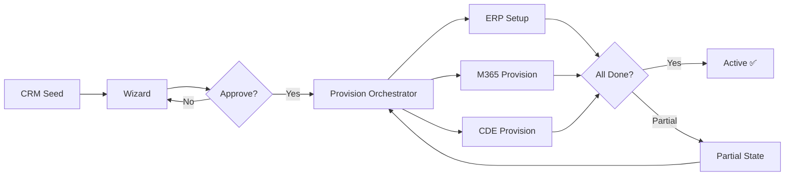

## Branch Context

This file is the design brief for branch `feature/m01-project-initialization`.
All module artifacts in this branch are work-in-progress.

**Merge path:**
1. Complete merge checklist below
2. Architecture review session (Pull Request review)
3. Approved changes merge to `main` via PR
4. `master.md` updated on `main` to reflect M01 as `approved`

---

# Fork: Project Initialization Module (Working Draft)

> ⚠️ **Note on filename:** This file is named `project-intialization-module.md` to preserve the original typo from the task specification for compatibility. The **canonical spelling** is `project-initialization`. All internal references use the canonical form.

---

## Fork Hypothesis

We are testing whether a **template-driven, event-orchestrated project initialization workflow** can replace the current fragmented manual process. The hypothesis:

> **If we automate project initialization using templates + API-driven provisioning, we can reduce setup time by 50% while improving consistency and compliance.**

---

## Proposed Changes to Master/Module

### 1. Requirements Delta

| ID | Change | Type | Rationale |
|---|---|---|---|
| REQ-M01-016 | NEW: Display similar past projects from KG | Addition | Helps PMs leverage institutional knowledge |
| REQ-M01-017 | NEW: Save/resume creation drafts | Addition | Supports PMs who can't complete in one session |
| REQ-M01-035 | CHANGED: Upgraded from "Could" to "Should" | Priority change | Reference data seeding is more valuable than initially assessed |
| REQ-M01-054 | NEW: Support partial provisioning states | Addition | Realistic — not all systems are always available |
| REQ-M01-068 | NEW: Support project creation from mobile | Idea | Future consideration, not MVP |

### 2. Data Model Delta

**New entities proposed:**
- `ENT-ProvisioningJob` — tracks the overall provisioning process
- `ENT-ProvisioningTask` — individual steps within a job

**Modified entities:**
- `ENT-Project` — add `opportunity_id`, `retry_count`, `partial_state_reason` attributes
- `ENT-ProjectTemplate` — add `estimated_setup_duration` attribute

**Relationships changed:**
- `Project` 1:N `ProvisioningJob` (new)
- `ProvisioningJob` 1:N `ProvisioningTask` (new)

### 3. Workflow Proposal

**Key change from initial design:** Provisioning steps (ERP, M365, CDE) can run in **parallel** rather than sequential, reducing total setup time. The orchestrator manages dependencies.

### 4. Interface Impact Table

| Interface | Impact | Description |
|---|---|---|
| IF-M01-CRM-001 | No change | Seed data contract stable |
| IF-M01-HR-001 | No change | User lookup contract stable |
| IF-M01-ERP-001 | **Modified** | Add retry support and idempotency key |
| IF-M01-M365-001 | **Modified** | Add channel templates to payload |
| IF-M01-CDE-001 | No change | Workspace provisioning contract stable |
| IF-M01-TEMPLATE-001 | **Modified** | Add `estimated_setup_duration` to template |
| IF-M01-KG-001 | **New** | Knowledge graph query interface |

---

## Open Questions for Review

1. **Parallel vs. Sequential provisioning:** Should M365 and CDE provisioning run in parallel or sequentially? Parallel is faster but harder to roll back.
2. **Idempotency:** How do we handle duplicate provisioning requests? Propose idempotency keys on all external API calls.
3. **Approval before provisioning:** Should there be a formal approval step before provisioning starts, or should PM self-approve for standard templates?
4. **Knowledge Graph readiness:** Is the KG API ready for integration in MVP, or should we defer IF-M01-KG-001 to Sprint 2?
5. **ProjectWise support:** Should we include ProjectWise in MVP scope or defer to Sprint 2?

---

## Merge Checklist

- [ ] All requirements delta reviewed and approved
- [ ] Data model delta reviewed by Chief Architect
- [ ] Interface contracts updated in `module_interfaces.md`
- [ ] Workflow validated against edge cases
- [ ] Mermaid diagrams render correctly
- [ ] No orphan files created
- [ ] `00_index.md` updated
- [ ] `00_changelog.md` updated

---

## Review Decision Log

| Date | Reviewer | Decision | Notes |
|---|---|---|---|
| _Pending_ | @chief-architect | _—_ | _—_ |
| _Pending_ | @scrum-master | _—_ | _—_ |
| _Pending_ | @integration-lead | _—_ | _—_ |
