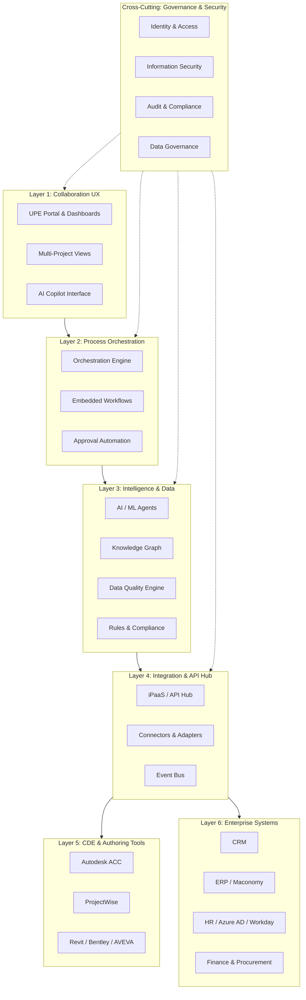

# UPE Master — Unified Project Execution

## Vision

**UPE (Unified Project Execution)** is the enterprise digital backbone for Ramboll — a cohesive platform ecosystem that orchestrates project delivery through integrated capabilities spanning project lifecycle management, intelligent process automation, knowledge management, and enterprise system integration.

UPE enables teams to work more efficiently, make better decisions, and capture organizational learning — transforming how engineering projects are initiated, executed, and closed.

> **Core Philosophy:** The "Parameterized Constructor" — a stable core (chassis) with modular, configurable variations that produce thousands of unique, high-quality projects from standardized building blocks.

---

## Scope

### What UPE IS
- **Coordination & Intelligence Layer** — sits above CDEs and authoring tools
- **Process Orchestration** — automates project workflows across systems
- **Knowledge Platform** — captures, organizes, and leverages organizational intelligence
- **Integration Hub** — connects CRM, ERP, HR, CDE, and design tools
- **Decision Support** — AI-powered insights for project delivery

### What UPE is NOT (Non-Goals)
- ❌ Does NOT replace CDE (ACC, ProjectWise) — CDE remains project system of record
- ❌ Does NOT replace DMS/authoring tools — engineers continue using Revit, Bentley, etc.
- ❌ Does NOT replace ERP/CRM — integrates with them, not substitutes
- ❌ Is NOT a document store — it's a coordination and intelligence surface
- ❌ Is NOT a generic project management tool — purpose-built for engineering project execution

---

## 14 Functional Domains

| # | Domain | Code | Priority | Key Outcome |
|---|---|---|---|---|
| 1 | Project Lifecycle & Environment Management | M01 | 🔴 High | Consistent project startup, knowledge preservation |
| 2 | User & Access Management | M02 | 🔴 High | Faster team assembly, security, audit compliance |
| 3 | Project Planning & Delivery Management | M03 | 🔴 High | Clear accountability, early warning systems |
| 4 | Data Quality & Validation | M04 | 🟡 Medium | Reliable data, error prevention, design reuse |
| 5 | Information Governance & Knowledge Management | M05 | 🟡 Medium | Reduced knowledge loss, AI-ready data |
| 6 | AI Integration & Intelligence Capabilities | M06 | 🟢 Strategic | Automation at scale, smarter workflows |
| 7 | System Integration & Interoperability | M07 | 🟡 Medium | Flexible architecture, seamless data flow |
| 8 | Embedded Process Automation & Workflow | M08 | 🟡 Medium | Simpler workflows, higher compliance |
| 9 | User Experience & Interface Design | M09 | 🟡 Medium | Reduced friction, better situational awareness |
| 10 | Foundational Requirements & Technical Enablement | M10 | 🔴 High | Reliable foundation, extensibility |
| 11 | Platform Governance & Roadmap Management | M11 | 🟢 Strategic | Coherent evolution, stakeholder alignment |
| 12 | Monitoring, Diagnostics & Operational Support | M12 | 🟢 Strategic | Reliable operations, data-driven optimization |
| 13 | Technology Enablement & Build vs. Buy | M13 | 🟡 Medium | Cost efficiency, rapid capability delivery |
| 14 | Special Capability Domains (BIM/GIS, Time, Contracts) | M14 | 🟢 Strategic | End-to-end project coverage |

**Total Capabilities: 175+** across 14 domains.

---

## Layered Architecture

---

## Module Registry

| Module | Domain | Owner | Status | Phase |
|---|---|---|---|---|
| **M01** | Project Initialization & Provisioning | @module-owner-m01 | `draft` | Phase 1 |
| M02 | User & Access Management | @module-owner-m02 | `idea` | Phase 1 |
| M03 | Project Planning & Delivery | @module-owner-m03 | `idea` | Phase 1 |
| M04 | Data Quality & Validation | @module-owner-m04 | `idea` | Phase 2 |
| M05 | Knowledge Management | @module-owner-m05 | `idea` | Phase 2 |
| M06 | AI Integration | @module-owner-m06 | `idea` | Phase 2-3 |
| M07 | System Integration | @module-owner-m07 | `idea` | Phase 1-2 |
| M08 | Process Automation | @module-owner-m08 | `idea` | Phase 2 |
| M09 | User Experience | @module-owner-m09 | `idea` | Phase 1 |
| M10 | Technical Foundations | @module-owner-m10 | `idea` | Phase 1 |
| M11 | Platform Governance | @module-owner-m11 | `idea` | Phase 3 |
| M12 | Monitoring & Operations | @module-owner-m12 | `idea` | Phase 3 |
| M13 | Technology Enablement | @module-owner-m13 | `idea` | Phase 1-2 |
| M14 | Special Domains | @module-owner-m14 | `idea` | Phase 3 |

**M01 is currently in active design on branch `feature/m01-project-initialization`.
Review via Pull Request before merge to main.**

---

## Phase 1 Focus (Months 1–6)

**Objective:** Establish core project context and basic automation.

| Capability | Module | Value |
|---|---|---|
| Project Initialization & Provisioning (MVP) | M01 | 40% faster project startup |
| Basic Data Model | M10 | Canonical project entities |
| User Onboarding/Offboarding | M02 | <1 day to onboard team member |
| Project Progress Tracking | M03 | Real-time project health |
| Role-Based Access Management | M02 | Secure, consistent access |
| Teams/SharePoint Integration | M07, M13 | Collaboration out of the box |

**Estimated Effort:** 4–6 FTE  
**Tech Stack:** Microsoft 365 E5 + Azure + Autodesk APIs  
**Primary Value:** 40% faster project startup, reduced errors

---

## Architecture Decisions

| Decision | ID | Status | Reference |
|---|---|---|---|
| Docs-as-Data with Markdown+Mermaid+Git as source of truth | ADR-0001 | accepted | [ADR-0001](architecture/decisions/ADR-0001-docs-as-data.md) |
| Hybrid Build-vs-Buy: buy commodity, build differentiating | — | accepted | [arch_overview.md](architecture/arch_overview.md) |
| CDE remains project system of record; UPE is coordination layer | — | accepted | [arch_overview.md](architecture/arch_overview.md) |

---

## Open Questions

1. Data Centralization vs. Federation — single data lake vs. distributed with views?
2. AI Approach — enterprise AI platform (custom) or vendor AI + vibe coding?
3. Knowledge Representation — RDF/semantic web or simpler taxonomy?
4. Vendor Stack depth — commit deeply to Microsoft+Autodesk or keep options open?
5. Funding model — product team budget vs. project budgets?

---

## Traceability to Source Documents

| Source | Path | Relevance |
|---|---|---|
| LLM-Native Product Design Framework | `prompts/LLM-Native Product Design Framework.md` | Defines DDDM methodology |
| UPE Executive Summary v1 | `docs/UPE_Executive_Summary_v1.md` | 14 domains, phases, metrics |
| UPE Functional Blocks v1 | `docs/UPE_Functional_Blocks_v1.md` | 175+ capabilities, Section 1.1 for M01 |
| Brainstorming | `docs/brainstorming.md` | Module architecture, M365 stack |
| Loop Workstreams | `src/loop/loop.md` | WS 3.1–3.5, data model, integration |
| Copilot Sparing Session | `src/loop/loop.md` (embedded) | Layered architecture, build vs buy |
