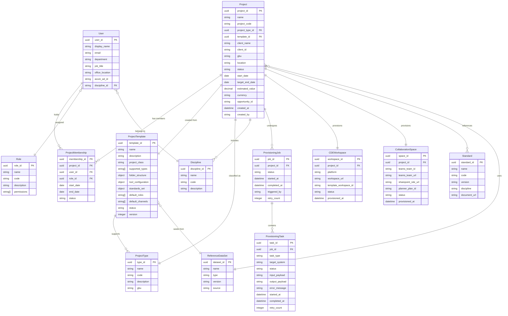

# M01 Data Model — Project Initialization

## Entity Relationship Diagram

---

## Entity Definitions

### ENT-Project
The central entity representing an engineering project in UPE.

| Attribute | Type | Required | Description |
|---|---|---|---|
| `project_id` | UUID | ✅ | Primary key, auto-generated |
| `name` | String(200) | ✅ | Human-readable project name |
| `project_code` | String(20) | ✅ | ERP project code (from Maconomy) |
| `project_type_id` | UUID (FK) | ✅ | Reference to ProjectType |
| `template_id` | UUID (FK) | ✅ | Template used for provisioning |
| `client_name` | String(200) | ✅ | Client organization name |
| `client_id` | String(50) | ✅ | Client ID from CRM |
| `gbu` | String(10) | ✅ | Global Business Unit code |
| `location` | String(200) | ✅ | Project location / geography |
| `status` | Enum | ✅ | Current lifecycle status |
| `opportunity_id` | String(50) | — | CRM opportunity reference |

**Status values:** `seed`, `draft`, `provisioning`, `partial`, `active`, `suspended`, `closed`, `archived`

### ENT-ProjectTemplate
Reusable configuration template for project provisioning.

| Attribute | Type | Required | Description |
|---|---|---|---|
| `template_id` | UUID | ✅ | Primary key |
| `name` | String(100) | ✅ | Template name |
| `project_class` | String(50) | ✅ | Class/category this template serves |
| `folder_structure` | JSON | ✅ | Folder tree definition |
| `tool_configuration` | JSON | ✅ | Tool provisioning config |
| `standards_set` | JSON | ✅ | Standards to associate |
| `default_roles` | String[] | ✅ | Default role set |
| `default_channels` | String[] | ✅ | Default Teams channels |

### ENT-ProvisioningJob
Tracks the provisioning process for a project from start to finish.

| Attribute | Type | Required | Description |
|---|---|---|---|
| `job_id` | UUID | ✅ | Primary key |
| `project_id` | UUID (FK) | ✅ | Project being provisioned |
| `status` | Enum | ✅ | `pending`, `running`, `completed`, `failed`, `partial` |
| `retry_count` | Integer | ✅ | Number of retries attempted |

### ENT-ProvisioningTask
Individual provisioning step within a job (e.g., "Create Teams team", "Provision CDE workspace").

| Attribute | Type | Required | Description |
|---|---|---|---|
| `task_id` | UUID | ✅ | Primary key |
| `job_id` | UUID (FK) | ✅ | Parent job |
| `task_type` | String(50) | ✅ | `m365_provision`, `cde_provision`, `erp_setup`, `access_setup`, `data_model_init` |
| `target_system` | String(50) | ✅ | External system name |
| `status` | Enum | ✅ | `pending`, `running`, `completed`, `failed`, `skipped`, `retrying` |
