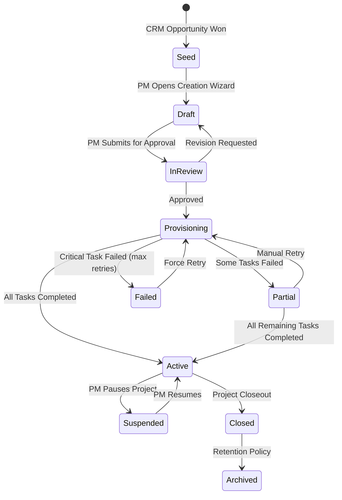
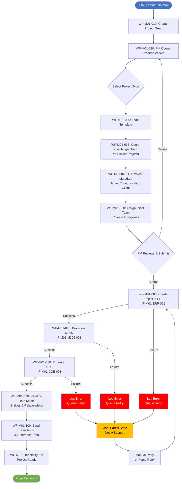
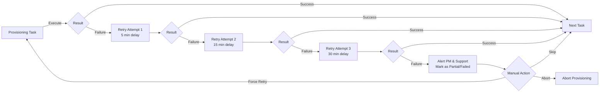

# M01 Workflows — Project Initialization

## Project Lifecycle State Machine

---

## End-to-End Project Initialization Flow

---

## Workflow Steps Detail

### WF-M01-010: Create Project Seed
- **Trigger:** CRM webhook (opportunity status = "Won") or manual trigger
- **Actor:** System (automated)
- **Input:** Opportunity data from CRM (IF-M01-CRM-001)
- **Output:** Project record with status `seed`
- **Error:** If CRM data incomplete → create `draft` project with missing fields flagged

### WF-M01-020: Open Creation Wizard
- **Trigger:** PM navigates to "New Project" or clicks link from seed notification
- **Actor:** Project Manager
- **Input:** Project seed (if exists) or blank form
- **Output:** Draft project in wizard state

### WF-M01-030: Load Template
- **Trigger:** PM selects project type/class
- **Actor:** System
- **Input:** Project type, class, GBU
- **Output:** Template configuration loaded (IF-M01-TEMPLATE-001)

### WF-M01-035: Query Knowledge Graph
- **Trigger:** Template loaded
- **Actor:** System
- **Input:** Project type, client, location, disciplines
- **Output:** List of similar projects and suggested standards (IF-M01-KG-001)
- **Note:** Non-blocking — failure does not prevent creation

### WF-M01-040: Fill Project Metadata
- **Trigger:** Template loaded
- **Actor:** Project Manager
- **Input:** Template defaults + PM overrides
- **Output:** Complete project metadata

### WF-M01-050: Assign Initial Team
- **Trigger:** Metadata complete
- **Actor:** Project Manager
- **Input:** User search from Azure AD (IF-M01-HR-001)
- **Output:** Initial team with roles assigned

### WF-M01-060: Create Project in ERP
- **Trigger:** PM submits creation
- **Actor:** System
- **Input:** Project metadata
- **Output:** ERP project code and financial context (IF-M01-ERP-001)

### WF-M01-070: Provision M365
- **Trigger:** ERP code assigned
- **Actor:** System
- **Input:** Template config + team + project metadata
- **Output:** Teams team, SharePoint site, Planner board URLs (IF-M01-M365-001)

### WF-M01-080: Provision CDE
- **Trigger:** M365 provisioning complete
- **Actor:** System
- **Input:** Template config + project metadata
- **Output:** CDE workspace URL and folder structure (IF-M01-CDE-001)

### WF-M01-090: Initialize Data Model
- **Trigger:** CDE provisioning complete
- **Actor:** System
- **Input:** Project metadata, template, team
- **Output:** All data model entities created (Project, Memberships, Workspaces)

### WF-M01-100: Seed Standards & Reference Data
- **Trigger:** Data model initialized
- **Actor:** System
- **Input:** Template standards set
- **Output:** Standards linked to project, reference data loaded

### WF-M01-110: Notify PM
- **Trigger:** All provisioning tasks complete
- **Actor:** System
- **Input:** Project record with all URLs
- **Output:** Email/Teams notification to PM with project dashboard link

---

## Failure & Recovery Workflow

