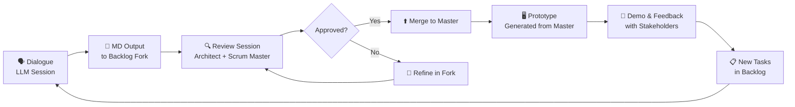
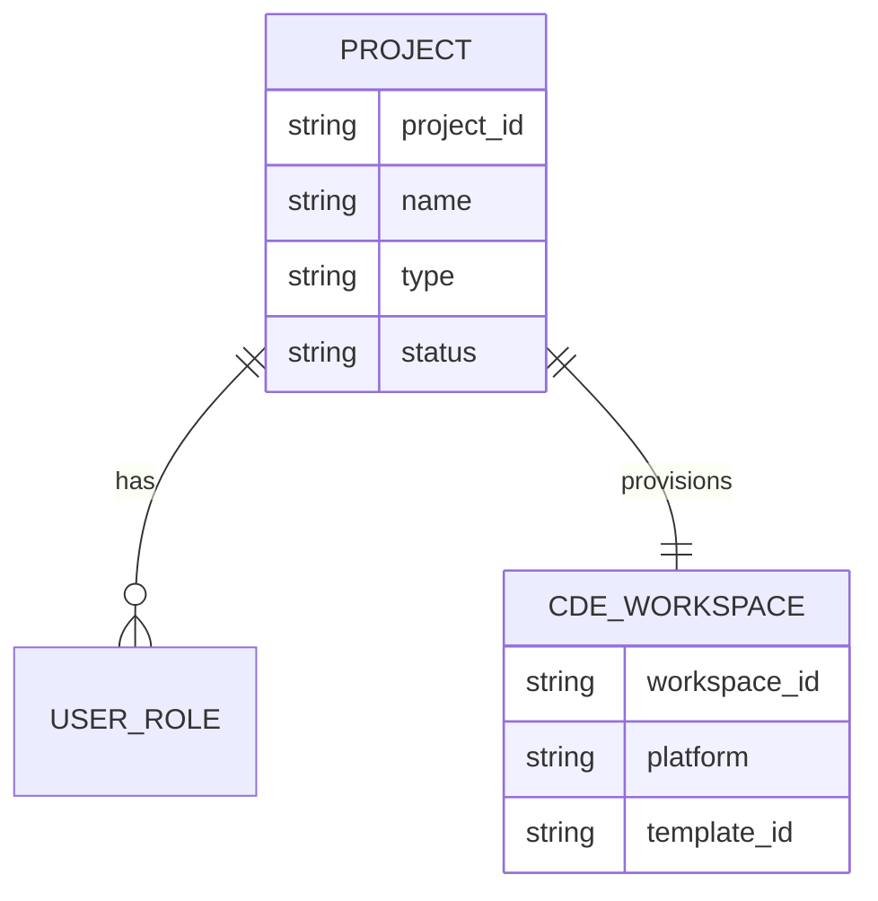
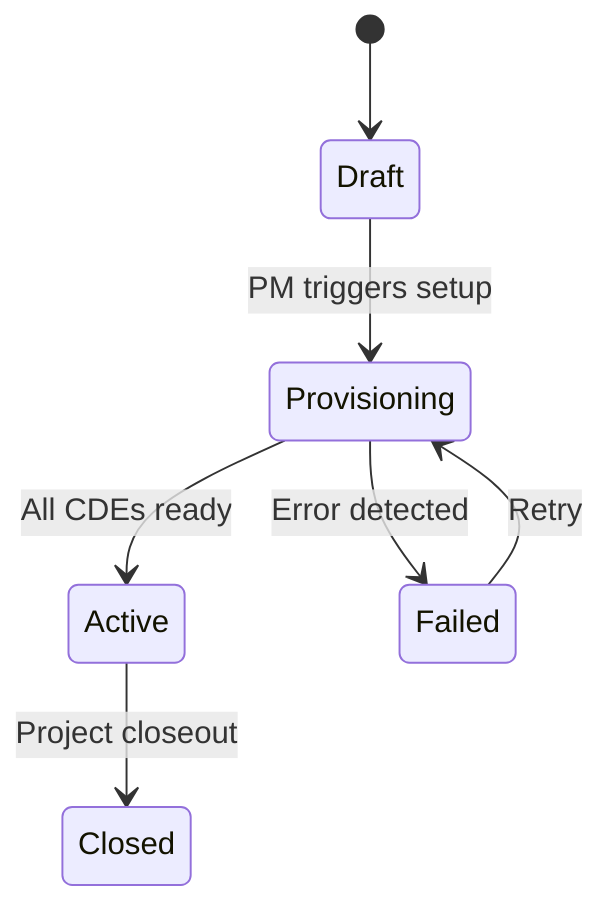

# давай проработаем организацию работы над проектом с использованием нового подхода. мы отказываемся от использования традиционных ТЗ, спецификаций, диаграмм и прочего. мы идём по пути разработки решения в формате диалога с LLM, в ходе диалога мы формулируем базу знаний и лучших практик. она формируется как репозиторий MD файлов, с индексной таблицей. разработка ведётся по модульно. главный архитектор управляет целостной картиной и решает какие блоки и как они будут взаимодействовать друг с другом. мы начинаем с фундамента, а именно интерфейсов между модулями, framework, правила изменений, принципы описания решения, как складировать md файлы, как правильно вести лог, изменений, как выполнять review, как имплиминтировать решения в центральное хранилище. что то вроде backlog и forks с прогрессом и merge request во время review сессий. возможно предусмотреть использовать obsidian или другое Open source решение или что то из экосистемы azure, Microsoft для организации базы знаний. Я бы хотел применить принципы из репозитория

https://gist.github.com/karpathy/442a6bf555914893e9891c11519de94f но использовать их в контексте дизайна продукта, не разработка. идея такая - работает несколько человек, каждый над своим модулем. результаты работы складируются в виде md сформированные по единым стандартам в хранилище backlog. там мы создаём fork от мастера и прорабатываем в взаимодействии с LLM дизайн решения, все аспекты, структуру потоков, схему бд, рабочие процесс, требования от бизнеса, все аспекты по BPMN или другим фреймворка. все это именно в виде md. потом мы выполняем review, в ходе review решаем что имплиминтировать и как. причем мы можем сразу на основании мастера формировать прототип и проводить демо сессию с заказчиком. сразу видно на прототипе или MVP как это будет работать и выглядит. собираем фидбек, бьём на задачи и отдаем людям, и опять цикл разработки. так итерационно идём к решению и повышаем зрелость. все документирует на md и складируем в хранилище и ведём беклог и лог изменений. важно, всю документацию, схемы, графики и прочее получаем из мастера по мере изменений как отчёты, это производные от базы знаний. данные в первую очередь, документы и отчёты - это слепок. используем мармелад язык и другие стандарты чтобы строить схемы решения. работа совместно, главный архитектор и скрам мастер следят за консистентностью и целостность решение. дай мне саммари на такой подход и давай сформулируем нечто вроде framework описания дизайна продукта с использованием подхода "данные - first". напиши мне как это реализовать подробнее

This is an excellent and very modern approach. Let me give you a structured summary and a practical framework.

***

# LLM-Native Product Design Framework

## Core Philosophy

The approach you're describing is **"Docs-as-Data, Design-by-Dialogue"** — a methodology where:

- **Knowledge is the source of truth**, not documents
- **Documents and diagrams are derived outputs** (rendered from data, not authored manually)
- **LLM dialogue is the design tool**, not UML editors or Word docs
- **Git-style discipline** governs knowledge evolution, not document versioning

This aligns directly with Andrej Karpathy's [vibe coding manifesto](https://gist.github.com/karpathy/442a6bf555914893e9891c11519de94f) — but applied to **product design**, not code [^1].

***

## The Framework: DDDM — Dialogue-Driven Design Method

### Foundational Principles

1. **Data First** — every decision, requirement, flow, schema lives as structured MD in the repo; reports and diagrams are rendered on demand
2. **Dialogue is work** — LLM sessions are not brainstorming, they are the primary design instrument; outputs go directly to backlog
3. **Single source of truth** — one `master` branch of the knowledge repo; all forks are ephemeral work-in-progress
4. **Modularity** — each domain module is independently owned and described; the Chief Architect owns interfaces and integration contracts
5. **Traceability** — every MD file has a header with owner, status, version, last-reviewed date, and parent module
6. **Render on demand** — Mermaid, PlantUML, and D3 generate all diagrams from MD; no manual diagram files

***

## Repository Structure

```
/upe-knowledge-base
│
├── 00_index.md                  ← Master index & module registry
├── 00_changelog.md              ← Global change log
├── 00_principles.md             ← Framework rules & conventions
├── 00_glossary.md               ← Canonical terminology
│
├── /architecture
│   ├── arch_overview.md         ← Chief Architect's integration map
│   ├── module_interfaces.md     ← API contracts between modules
│   └── decisions/
│       ├── ADR-001_cde_stack.md ← Architecture Decision Records
│       └── ADR-002_auth.md
│
├── /modules
│   ├── /m01_project_init
│   │   ├── index.md             ← Module overview & status
│   │   ├── requirements.md      ← Business & functional requirements
│   │   ├── data_model.md        ← Entities, attributes, relationships
│   │   ├── workflows.md         ← BPMN-style flows in Mermaid
│   │   ├── api_spec.md          ← Interface contracts
│   │   └── backlog.md           ← Module-level task backlog
│   ├── /m02_user_access/
│   ├── /m03_cde_provisioning/
│   └── /m04_data_quality/
│
├── /sessions
│   └── 2026-05-23_init_module_dialogue.md  ← LLM session logs
│
├── /prototypes
│   └── /sprint-01_project_init/            ← Prototype specs & feedback
│
└── /reports                                ← Auto-generated snapshots
    ├── current_state_snapshot.md
    └── stakeholder_brief_2026-05.md
```


***

## MD File Standard Header

Every file must open with this front-matter block:

```markdown
---
module: m01_project_init
type: workflow | data_model | requirements | decision | backlog
status: draft | in-review | approved | deprecated
owner: @andrei
reviewer: @olivier
version: 0.3
last_updated: 2026-05-23
parent: modules/m01_project_init/index.md
tags: [project-init, CDE, access-control]
---
```


***

## Git Workflow (Design Branching Model)

```mermaid
gitGraph
   commit id: "master baseline"
   branch m01-project-init-design
   checkout m01-project-init-design
   commit id: "LLM session: requirements"
   commit id: "LLM session: data model"
   commit id: "LLM session: workflow"
   branch review-sprint-01
   checkout review-sprint-01
   commit id: "Chief Architect review"
   commit id: "Prototype generated"
   checkout master
   merge review-sprint-01 id: "Approved & merged"
```

**Branch naming convention:**

- `m{nn}-{module-name}-{topic}` for module work
- `review-sprint-{nn}` for review sessions
- `proto-{nn}-{feature}` for prototype-driven sessions

***

## The Iteration Cycle




***

## Module Description Standard

Each module MD must cover these **data-first layers**, in order:


| Layer | File | What it contains |
| :-- | :-- | :-- |
| **1. Context** | `index.md` | Module purpose, scope, owner, dependencies |
| **2. Requirements** | `requirements.md` | Business goals, user stories, constraints |
| **3. Data Model** | `data_model.md` | Entities, attributes, relationships (Mermaid ERD) |
| **4. Workflows** | `workflows.md` | BPMN flows, state machines (Mermaid flowchart/stateDiagram) |
| **5. Interface Contract** | `api_spec.md` | Inputs/outputs to other modules, API shape |
| **6. Rules \& Decisions** | `decisions/` | ADRs for all non-obvious choices |
| **7. Backlog** | `backlog.md` | Tasks, sprints, status |


***

## Diagram-from-Data Examples

**Entity Relationship (data_model.md):**



**Workflow (workflows.md):**




***

## Tooling Recommendations

| Need | Recommended Tool | Rationale |
| :-- | :-- | :-- |
| **Knowledge repo** | **Azure DevOps Wiki** or **GitHub** | Native MD, versioning, PR workflow already in your stack |
| **Local authoring** | **Obsidian** + Git sync plugin | Best-in-class MD authoring, graph view shows relationships between modules |
| **Diagram rendering** | **Mermaid** (native in GitHub/ADO) | Diagrams live in MD, no separate files |
| **Backlog** | **Azure DevOps Boards** | Link work items to MD files; traceable |
| **Prototype generation** | **Replit / v0.dev** + master MD as prompt | Generate MVP UI from knowledge base |
| **Review sessions** | **PR / Merge Request in ADO** | Comments, approvals, diffs on MD |
| **Session logs** | `/sessions/` folder in repo | Every LLM dialogue logged as MD |

**Obsidian** is particularly powerful here — its **graph view** lets you visualize relationships between modules visually, and with the **Git plugin** it syncs directly to your repo [^1].

***

## Roles \& Governance

| Role | Responsibility |
| :-- | :-- |
| **Chief Architect** | Owns `architecture/`, approves all merges to master, maintains `module_interfaces.md` |
| **Scrum Master** | Maintains `00_changelog.md`, tracks backlog health, runs review sessions |
| **Module Owner** | Owns their `/modules/m{nn}/` folder, drives LLM dialogue sessions |
| **LLM (AI)** | Design partner — structures requirements, generates data models, writes workflows, proposes ADRs |


***

## Key Rules (to put in `00_principles.md`)

1. **Never author diagrams manually** — all visuals are Mermaid in MD files
2. **Every LLM session produces a commit** — no session without output to repo
3. **Data model is defined before workflow** — workflows reference entities, not the reverse
4. **Interface contracts are written before module internals** — Chief Architect approves first
5. **Reports and stakeholder docs are rendered from master** — never edited directly
6. **No orphan files** — every file is linked in `00_index.md`
7. **ADR for every significant decision** — Architecture Decision Records are mandatory

***

This framework gives you a **living, queryable product design system** that generates documentation as a by-product of real design work — not the other way around. The next step would be to initialize the repo structure, write `00_principles.md`, and define the interface contracts for Module 01 (Project Initialization) as the first fork. Want to start that now?

<div align="center">⁂</div>

[^1]: https://github.com/psf/requests

